# Maps with basemaps

## Introduction

In this chapter, you'll learn how to use Mapbox to create interactive and static maps with basemaps.

We'll use the following libraries and data.

```{r, message=FALSE, warning=FALSE}
library(sf)
library(tidyverse)

africa <- read_sf("data/countries/africa.geojson")
```

### Basemaps

You already know how to create static maps with `geom_sf()`. 

```{r, message=FALSE}
africa %>% 
  ggplot() + 
  geom_sf()
```

In the above plot, `geom_sf()` draws the boundaries represented in the `geometry` column. This map is informative, but sometimes you'll want to plot your geospatial data on top of other features. For example, say we wanted a map of Africa with country names, major cities, rivers, streets, and lakes. We could add in all this information by adding data sources to our ggplot2 plot, but this could quickly get time-consuming, and our data would start to take up a lot of space.

Luckily, there are easier ways of adding _basemaps_ to your maps. A basemap is just a map that lies underneath the data you want to visualize. Basemaps can include any number of features. For example, a basemap could just be a satellite image, or could include features like rivers, streets, and geographic boundary names. 

Here's an example basemap from Mapbox, the mapping technology we'll use in this chapter.

```{r, echo=FALSE}
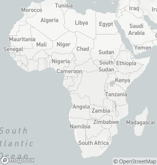
```

Mapbox's basemaps are interactive, so we can zoom in and get even more detail. For example, here's what the basemap looks like if we zoom in on Senegal.

```{r, echo=FALSE}
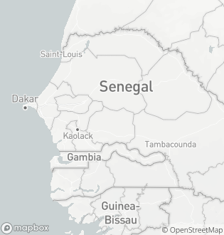
```

And here's what it look like if we zoom in even further, on a particular spot in Dakar.

```{r, echo=FALSE}
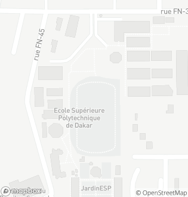
```

Basemaps can add context to your geospatial data, and keep you from having to include the same geographic features in every geospatial data set you want to visualize. In this chapter, we'll visualize the location of cholera deaths and water pumps on top of a basemap. This basemap allows us to see the street locations of the deaths and water pumps.

In this chapter, you'll learn how to create both interactive and static maps that include basemaps. We'll use [Mapbox](https://www.mapbox.com/) to create both maps. This chapter will walk you through using Mapbox Studio to create interactive maps, as well as how to use the Mapbox Static API to turn your interactive maps into PNG images.

### Tiles

With interactive web maps, it is usually possible to both zoom and move around the map, which means you'll only ever see a portion of the map at a time. Web maps handle this functionality by using _tiles_. Each tile contains data for a specific square sub-region of a map, and there are different sets of tiles for different zoom levels. 

There are two types of tiles: raster and vector. Raster tiles store their data in pixels, and so are like small pictures. Because they store their data in pixels, you can't easily edit aspects of the tiles. For example, imagine you had a set of raster tiles with highways colored blue, and you wanted to change the color of all highways to yellow. You would have to change each pixel that corresponded to a highway. 

Vector tiles store all data in vector format. This means that they can distinguish between different _layers_, such as roads, country borders, and lakes, and you can easily manipulate these elements before rendering. Vector tiles also make operations like tilting possible. If you wanted to change the color of the highways in a vector tileset, all you'd have to do is change the way that highways layer is displayed, which is fast and easy with vector data. 

In this reading, we'll walk you through the creation of two interactive Mapbox maps. When you're done creating each map, you'll have created a custom tileset with various layers and a set of rules for styling these layers.

### Mapbox

Mapbox provides infrastructure for developers to create vector-tile maps and map applications. It has a library of vector-tile basemaps with data from [OpenStreetMap](https://www.openstreetmap.org/about), an open data effort that works like Wikipedia for maps.

Mapbox has its own JavaScript library, Mapbox GL JS, that it uses to write custom interactive webmaps. Instead of explaining Mapbox GL JS, we'll use Mapbox Studio, which is a web interface to Mapbox GL JS. In Studio, you can create and edit Mapbox maps and share them via URL. You can then use Mapbox's Static API to create static versions of your maps. 

To introduce you to Mapbox Studio, we'll walk you through the creation of two maps that visualize John Snow's data on the 1854 London cholera epidemic. The first map will use circles to represent the number of deaths at a given location. The second will be a heatmap.

There are many features of Mapbox Studio that we won't cover here. You can read more about Studio in the [Studio Manual](https://docs.mapbox.com/studio-manual/overview/). 

## Data

### Background

In late August 1854, a severe cholera epidemic broke out in the Soho neighborhood of London. As recounted by Dr. John Snow

> The most terrible outbreak of cholera which ever occurred in this kingdom, is
  probably that which took place in Broad Street, Golden Square, and adjoining
  streets, a few weeks ago. Within two hundred and fifty yards of the spot
  where Cambridge Street joins Broad Street, there were upwards of five hundred
  fatal attacks of cholera in ten days. The mortality in this limited area
  probably equals any that was ever caused in this country, even by the plague;
  and it was much more sudden, as the greater number of cases terminated in a
  few hours. The mortality would undoubtedly have been much greater had it not
  been for the flight of the population. 

[@snow-1855, p. 38]

In 1854, many mistakenly believed that cholera was spread through the air. However, because the deaths were concentrated in such a small area, Snow suspected that the outbreak was due to contaminated water from a community water pump at Broad and Cambridge streets.

> On proceeding to the spot, I found that nearly all of the deaths had taken
  place within a short distance of the pump. There were only ten deaths in
  houses situated decidedly nearer to another street pump. In five of these
  cases the families of the deceased persons informed me that they always sent
  to the pump in Broad Street, as they preferred the water to that of the pump
  which was nearer. In three other cases, the deceased were children who went to
  school near the pump in Broad Street. Two of them were known to drink the
  water; and the parents of the third think it probable that it did so. 
  
[@snow-1855, p. 39-40]

Snow reported his findings to the authorities responsible for the community water supply, who then removed the handle from the Broad Street pump. The epidemic soon ended.

Snow visualized his data by creating a map showing the location of local water pumps and deaths from the outbreak. This map helped overturn the prevailing belief that cholera was an airborne disease. As a result, London improved its water infrastructure and developed procedures to eliminate future such cholera outbreaks.

###  Download data

Robin Wilson compiled Snow's data and made it available on his [website](http://blog.rtwilson.com/john-snows-cholera-data-in-more-formats/). We've formatted his data and converted the two files GeoJSON to make them easy to upload to Mapbox. These two GeoJSON files are available in the `data` folder. Let's read them in to see what they look like.

The original data can be downloaded [here](http://rtwilson.com/downloads/SnowGIS_KML.zip).

```{r}
deaths <- read_sf("data/cholera/cholera_deaths.geojson")
pumps <- read_sf("data/cholera/cholera_pumps.geojson")
```

```{r}
deaths
```

```{r}
pumps
```

Download `cholera_deaths.geojson` and `cholera_pumps.geojson`. Next, we'll upload these files to Mapbox.

### Upload data

If you don't already have a Mapbox account, create one by going to https://account.mapbox.com/auth/signup/.

Earlier, we introduced you to the idea of tiles. We want to create a custom tileset that includes standard features like roads and location labels, but that also includes the locations of the water pumps and deaths due to the cholera outbreak. In order to create this custom tileset, we first need to upload our data and convert it to its own tileset.

* Go to [Mapbox Studio](https://studio.mapbox.com/). If you're elsewhere in Mapbox, you can click the astronaut icon in the upper-right and then click __Studio__.
* Click on __Tilesets__ in the upper-right corner.
* Click the blue button labeled __New tileset__.
* Upload `cholera_deaths.geojson` and `cholera_pumps.geojson`. You'll have to upload one at a time. 
* The two tilesets should now appear in the list. Each tileset will have a random string identifier after its name.  

```{r, echo=FALSE}
# sara
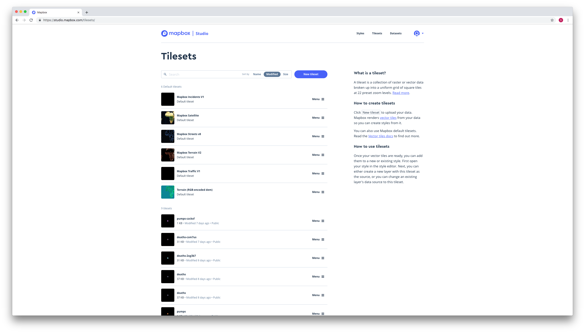
```

## Circle map

You now have everything you need to create a map in Mapbox Studio. We'll create the circle map first. At the end, you should have something that looks like this: 

```{r, echo=FALSE}
knitr::include_graphics("images/screenshots/circles-final.png")
```

You can view the map [here](https://api.mapbox.com/styles/v1/stanford-datalab/cjsqj3qvi3zrf1fld8qvywggs.html?fresh=true&title=true&access_token=pk.eyJ1Ijoic3RhbmZvcmQtZGF0YWxhYiIsImEiOiJjajh1aW84OXYxMWh5MndwMG9jYnhpc3ZiIn0.pSqbBonZJw667NNhHNX1Kg#16.2/51.513683/-0.136001).

### Create a style

In Mapbox, a _style_ is a specification for how your map will be drawn. Behind the scenes, this specification is written in JavaScript, but you can control the rules through Studio. You can think of a style like ggplot2 code for a visualization: it includes information about which data to use, specifies how to map that data to visual elements, and controls features of the visualization not related to the data (e.g., background colors, basemap elements).

We'll build our style on top of a basemap with an existing style. Mapbox Studio basemaps come in many different styles. 

* Click on the __Styles__ tab in the upper-right corner to take you back to the Styles page.
* Click __New style__. Take a look at the different template styles that Mapbox offers. Some are better for displaying data than others. We want the cholera deaths and water pumps to be the focus of our map, so we'll use a basemap with a subtle, light background. The Light style is the best option.
* Select the Light style.
* You should now be in Mapbox Studio and should see a basemap centered on Boston.
* Name your map something informative. In the upper-left corner, you'll see the default name of your map. If you used the Light style, your map will be named _Light_. Click on this name and change it to something like _Cholera circles_.

Your screen should now look like this:

```{r, echo=FALSE}
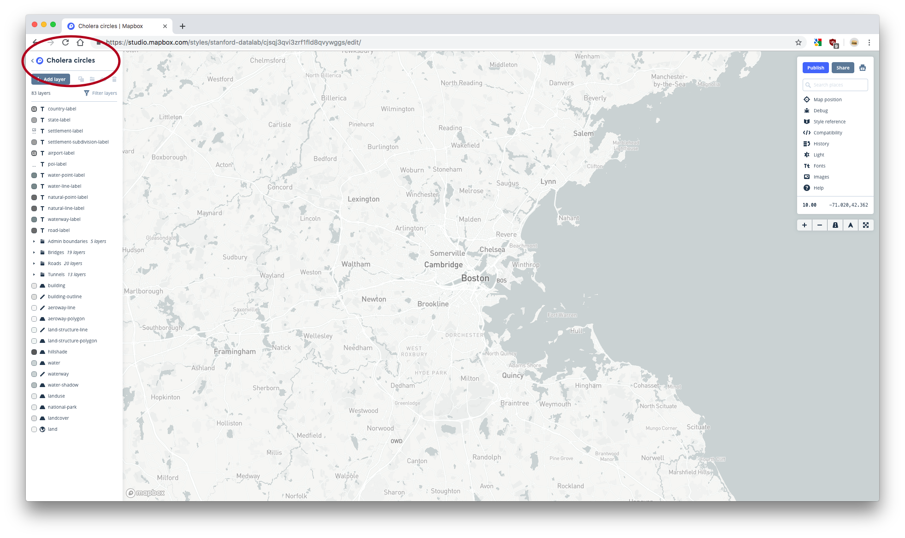
```

### Zoom in on London

The map is currently centered on Boston because the Light style's default location is Boston. Move the map to London either by manually navigating or by searching for _London_ in the search bar in the top-right corner.

```{r, echo=FALSE}
knitr::include_graphics("images/screenshots/circles-london.png")
```

### Add the deaths layer

The individual unit of a Mapbox map is a layer. You can see a list of all the layers included in the Light basemap on the left side of Studio. 

```{r, echo=FALSE}
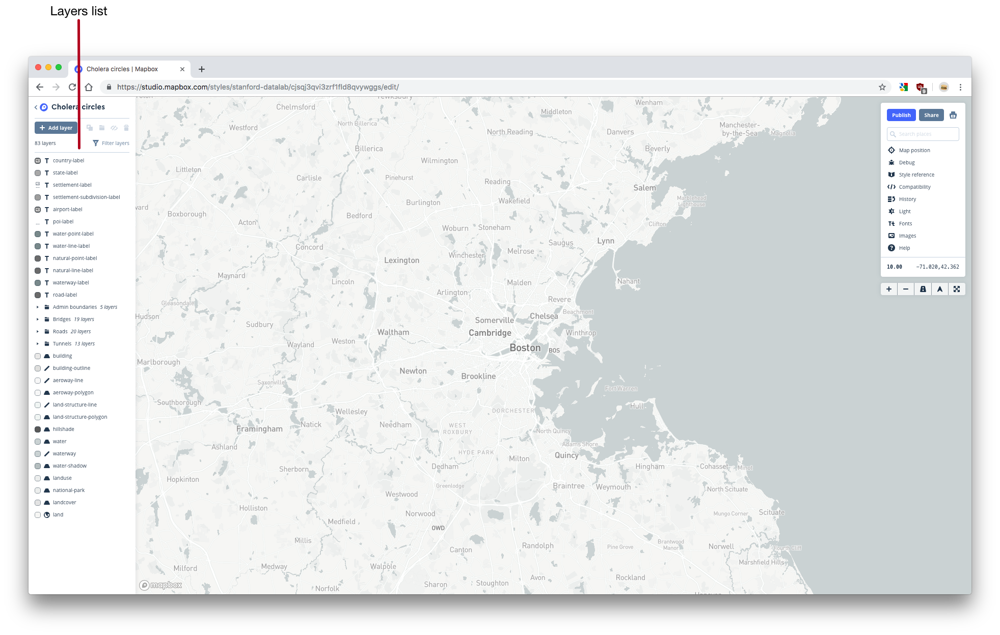
```

You can think of layers like ggplot2 geoms. Just like a geom, each layer maps data to a visual element (e.g., dots, lines, text), and you can control exactly how the data is mapped to that visual element. 

You can edit any existing layers by clicking on their name on the left. To hide the editor, just click on the name of the layer again.

We'll need three different layers to represent the deaths and pumps data. One layer will encode the deaths data as circles whose areas represent the number of deaths in that location. Another layer will represent the pump locations as circles. A final layer will label the pumps. First, we'll add the deaths layer.

* Click the gray __Add layer__ button in the upper-right corner. Your map will immediately look different. Don't worry, this isn't because you've accidentally changed some feature. Mapbox is just highlighting all the layers without styling them. 
* You are now in the layer editor for a new layer. Notice that _New layer_ now appears in the layer list on the left, and is highlighted to indicate that you're currently editing this layer.
* Notice that there are _Active sources_ and _Unused sources_ in the layer editor. Each of these sources is a tileset. Active sources are tilesets that the map currently uses to create different layers. Unused sources are available tilesets that are not yet used. 
* If you click on the name of a tileset, you'll see all the available layers in that tileset. The tilesets included with Mapbox, like Mapbox Streets v8, each contain many different layers. Our custom tilesets (cholera_deaths-* and cholera_pumps-*) each contain only one.

```{r, echo=FALSE}
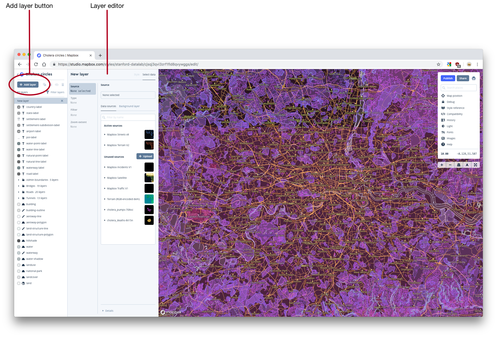
```

* Click on your _cholera_deaths-*_ tileset from the _Unused sources_ list. Then, click on the layer titled _cholera_deaths-*_ that appears underneath. 

```{r, echo=FALSE}

```

* We've now created a layer. By default, this layer will be named _cholera_deaths-*_.

```{r, echo=FALSE}
# sara
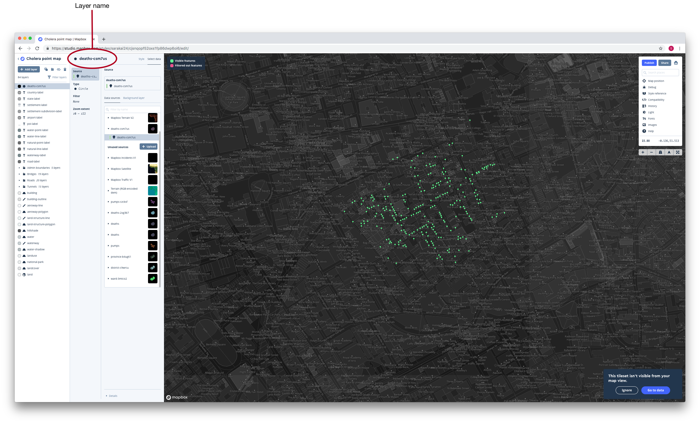
```

* Notice that you're currently in the __Select data__ tab of the layer editor. The layer editor has two tabs: __Select data__ and __Style__. In the __Select data__ tab, you can choose your data and choose the layer type. You can think of the layer type as a geom. By default, the type for our current layer is _Circle_, which happens to be what we want. For some of the layers we'll make later on, we'll need to change the type.

```{r, echo=FALSE}
# sara
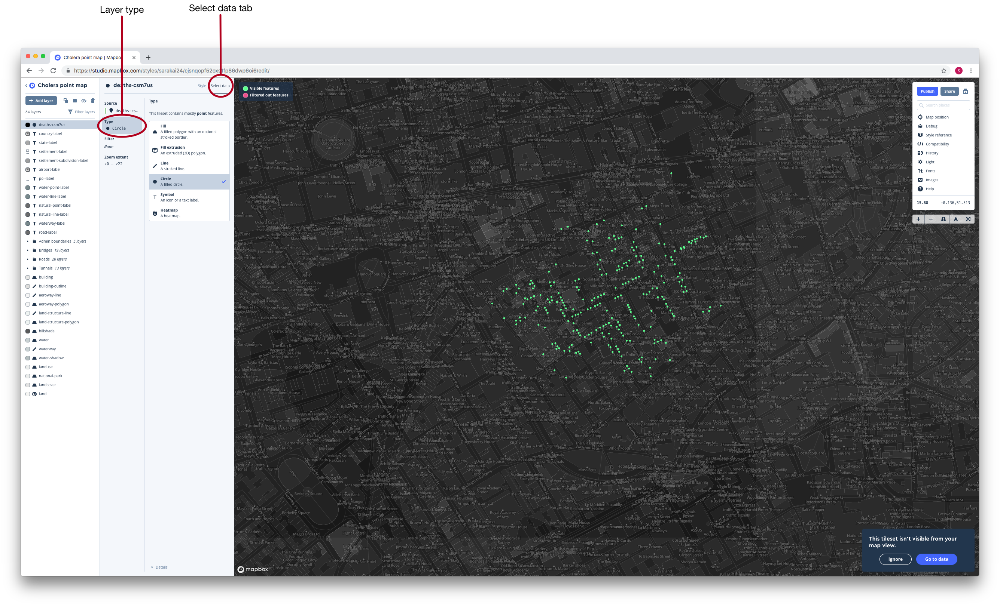
```

* If you click on the __Style__ tab, the map's appearance will go back to normal. In the __Style__ tab, you can control the appearance of your layer. If you think of the __Select data__ tab as where you choose the geom, the __Style__ tab is where you specify the aesthetics. In the next section, you'll use the __Style__ tab to map number of deaths to circle area.
* You should now see black dots on your map that represents the locations of deaths.

```{r, echo=FALSE}
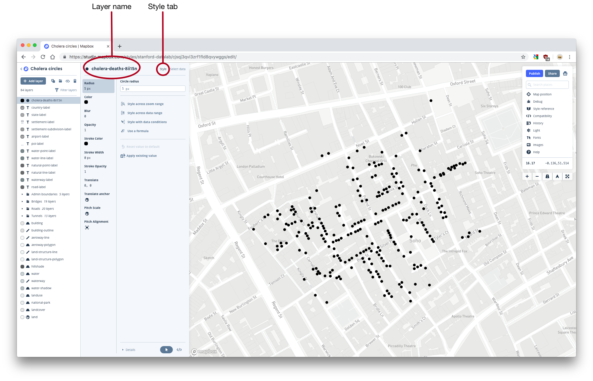
```

### Scale the dots

Right now, all the dots are the same size. We want to scale them so that the area of the circle encodes the number of deaths. 

* We said that the Style tab controls the aesthetic mappings. For circles, one aesthetic mapping you can control are the radii of the circles. 
* To map the number of deaths to circle radii, we could select __Style across data range__ from the __Radius__ tab. However, this will linearly scale the radii of the circles by the number of deaths at that location. We actually want to scale the areas of the circles, not the radii, so we'll have to use a custom formula.
* Click __Use a formula__.

```{r, echo=FALSE}
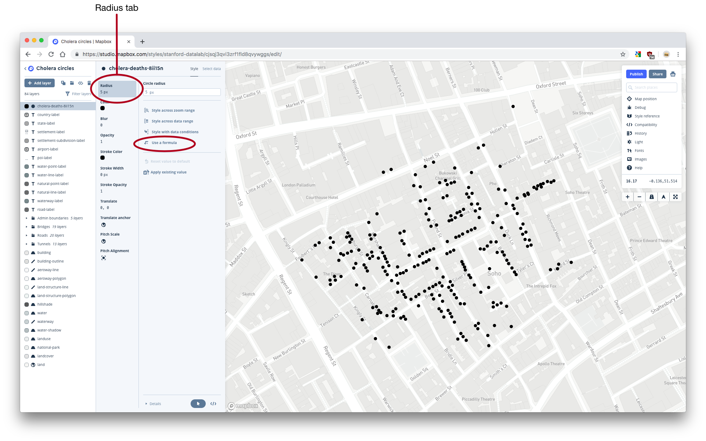
```

* The formula we want to use takes the form `x * sqrt(deaths)`, where `x` is a constant. 
* Start adding the formula to the formula box. Use `sqrt()` for square root. Click on __Insert a data field__ and then on __deaths__ to use the `deaths` variable.
* Here's what your map should look like without `x`:

```{r, echo=FALSE}
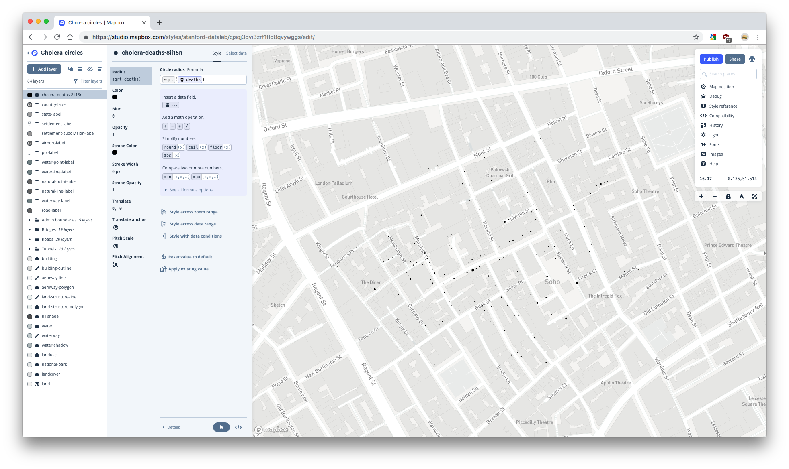
```

* Play around with different values of the constant `x` until you're happy with the appearance of your dots. Your map should now look something like this:

```{r, echo=FALSE}
knitr::include_graphics("images/screenshots/circles-deaths-radius-scaled.png")
```

In this screenshot, the editing sidebar for the deaths layer is hidden. You can hide the editing sidebar by clicking on the name of the layer you're editing.

### History

If you need to, you can undo actions by clicking on __History__ in the menu on the right. Clicking the undo arrow will undo your last action. You can also click on the name of an action to revert your map further.

```{r, echo=FALSE}
# sara
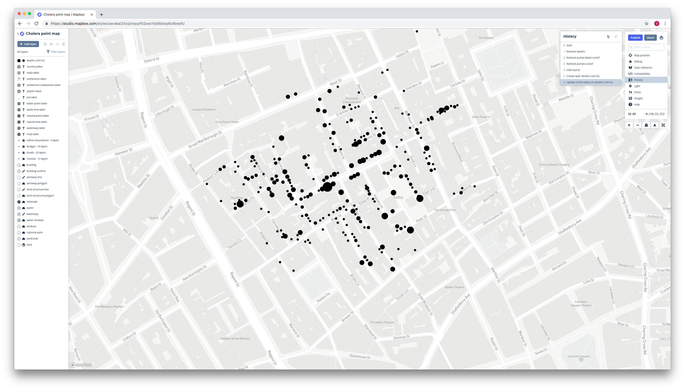
```

### Change the appearance of the dots

* Make sure you're on the __Style__ tab of the _cholera_deaths-*_ layer editor.
* Use the __Color__ tab to change the color of your circles to red. 

```{r, echo=FALSE}
# sara
# color = ca0020
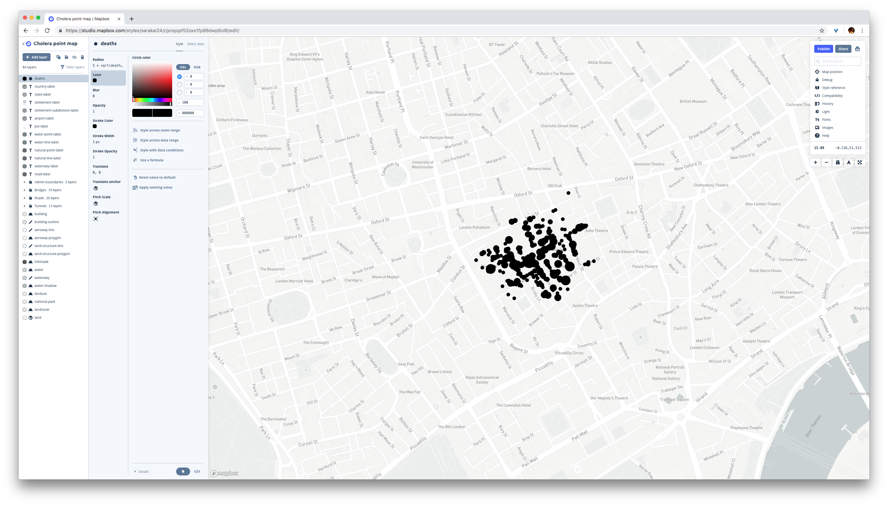
```

* At some zoom levels, the dots are over-plotted. Change the opacity of the dots and add a border by changing the opacity in the __Opacity__ tab. Add a border to the circles by adjusting the stroke width in the __Stroke width__ tab.
* When you're done, your map should look something like this:

```{r, echo=FALSE}
knitr::include_graphics("images/screenshots/circles-deaths-layer-styled.png")
```

### Add the pumps layer

Now, we'll add a layer to represent the pump locations.

* Again, click on __Add layer__ to create a new layer.
* Click on your _cholera_pumps-*_ tileset from the unused sources list. Then, click on the _cholera_pumps-*_ layer that appears underneath.
* Go to the __Style__ tab of the layer editor.

```{r, echo=FALSE}
knitr::include_graphics("images/screenshots/circles-pumps-layer.png")
```

* If you want to change the size of the circles, go to __Radius__ and change the value of __Circle radius__.
* You should now have a map that looks like this:

```{r, echo=FALSE}
knitr::include_graphics("images/screenshots/circles-pumps-layer-radius.png")
```

### Add the pumps labels layer

It would be helpful to label each dot that represents a pump. If you were building a ggplot2 plot, you might use both `geom_point()` and `geom_text()` to create a plot with labeled points. Similarly, with Mapbox you have to add two layers to create labeled points: one for the points and one for the labels. We already added the point layer, so now we just have to add the label layer.

* Add a new layer by clicking __Add layer__. Your _cholera_pumps-*_ tileset is now an active source. Click on your _cholera_pumps-*_ tileset then on the _cholera_pumps-*_ layer that appears underneath.
* By default, the layer will be named _cholera_pumps-* (1)_. Change the name of the layer to _cholera-pump-labels-*_ by clicking on the layer name towards the top of the layer editor.

```{r, echo=FALSE}
# sara
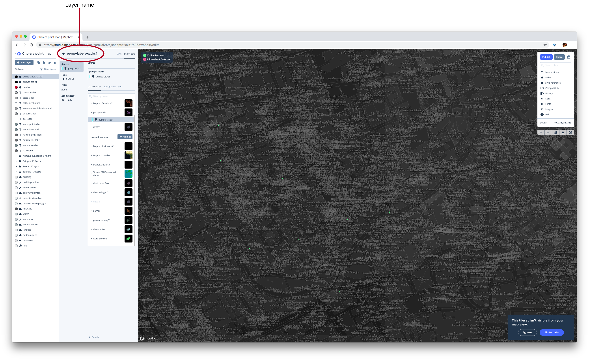
```

* By default, the layer type for the _cholera-pump-labels-*_ layer is _Circle_, but we want text, not dots, for this layer. Change the layer type in the __Type__ tab to _Symbol_.

```{r, echo=FALSE}
# sara
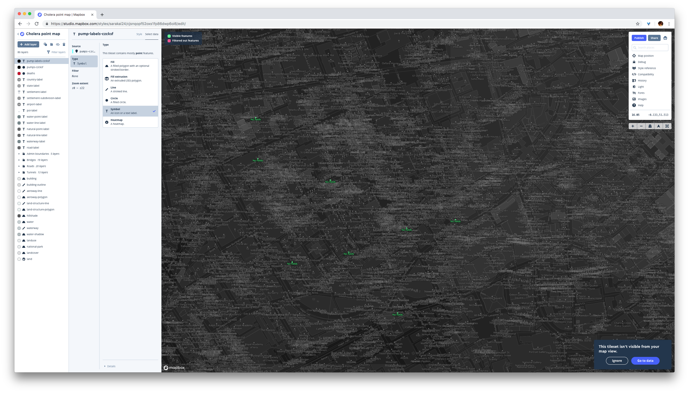
```

* Now, we need to set the labeling text. Move back to the __Style__ tab, then type _Pump_ text box. This will set every label to _Pump_.
* The labels are directly on top of the dots. To offset the labels, first click on __Position__. This tab contains several variables related to the positioning of the text.

```{r, echo=FALSE}
knitr::include_graphics("images/screenshots/circles-pump-labels-position.png")
```

* Use the __Text offset__ tab to adjust the offsets. You should end up with something that looks like this:

```{r, echo=FALSE}
knitr::include_graphics("images/screenshots/circles-final.png")
```

Your map is complete! 

### Publish your map

* Now, you just need to make your map visible to others by publishing. 
* When you publish your map, you'll get a share URL that others can use to view your map. This public version of your map will have a starting location and zoom level. By default, this location and zoom level will the location and zoom level of your editing map when you click __Publish__. Before publishing, make sure you're happy with the current location and zoom level.
* Publish your map by clicking the blue __Publish__ button in the upper-right corner. Then, choose __Publish__.

```{r, echo=FALSE}
knitr::include_graphics("images/screenshots/circles-publish.png")
```

* Change your map's visibility setting to _Public_. Your map needs to be public in order to use the static API.
* Copy the URL and store it somewhere. You'll also need this URL for the static API later on.

## Heatmap

Now, we'll create a heatmap. Your final result should look something like this:

```{r, echo=FALSE}
knitr::include_graphics("images/screenshots/heatmap-final.png")
```

You can view the map [here](https://api.mapbox.com/styles/v1/stanford-datalab/cjsuo2k338t411fsenxjvz4aw.html?fresh=true&title=true&access_token=pk.eyJ1Ijoic3RhbmZvcmQtZGF0YWxhYiIsImEiOiJjajh1aW84OXYxMWh5MndwMG9jYnhpc3ZiIn0.pSqbBonZJw667NNhHNX1Kg#15.8/51.512938/-0.135532/0).

### Create a style

* Go back to the [Studio homepage](https://studio.mapbox.com/).
* Create a new map with a Light style basemap by clicking on __New style__ and choosing the Light style. 
* Once the map has opened, change the name to something more informative, like _Cholera heatmap_.
* Navigate to London.

```{r, echo=FALSE}
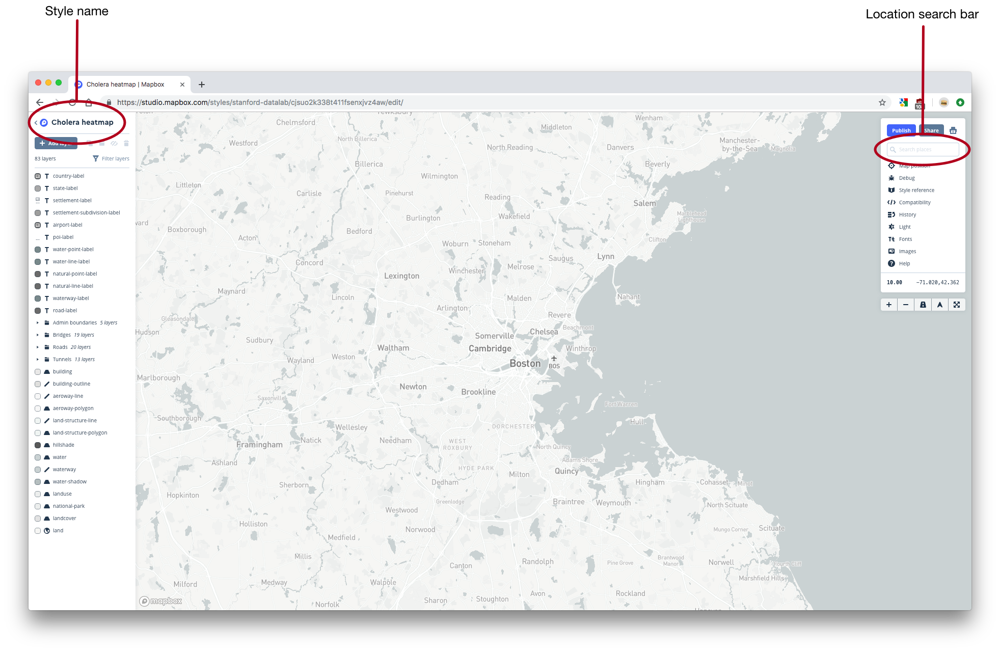
```

### Add the pumps layers

Mapbox can plot layers on top of each other. Each time you add a new layer, Mapbox places it on top of all other existing layers. This means that you'll typically want to add layers from the bottom up. Our heatmap has a heatmap layer underneath the two pumps layers, so ordinarily you would add the heatmap layer first, and then add the pumps layers. 

Here, we'll add the pumps layers first so that you can see how to change the layer order.

We'll add the two pumps layers exactly as we did for the circles map.

* First, add a layer for the pumps dots. Click __Add layer__, then select the _cholera_pumps-*_ layer from underneath your _cholera_pumps-*_ tileset.

```{r, echo=FALSE}
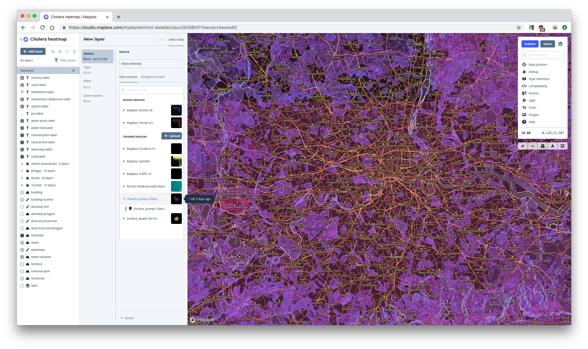
```

* If you want, change the radius of the pumps circles. You'll end up with a map that looks like this:

```{r, echo=FALSE}
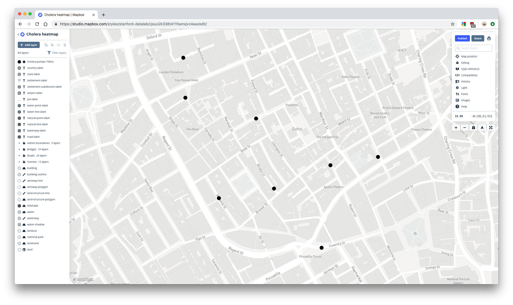
```

* Next, add the pump labels layer. Select the _cholera_pumps-*_ layer from your _cholera_pumps-*_ tileset that will now appear in the active sources list.

```{r, echo=FALSE}
knitr::include_graphics("images/screenshots/heatmap-add-pumps-labels.png")
```

* Change the name of the layer to _cholera-pump-labels-*_ and change the type of _Symbol_. 

```{r, echo=FALSE}
knitr::include_graphics("images/screenshots/heatmap-pumps-labels-type.png")
```

* Change to the __Style__ tab to set the text and adjust the offsets. Recall that the text offset setting is under the __Position__ tab.

```{r, echo=FALSE}

```

### Add the deaths heatmap layer

* Add the deaths layer by selecting the _cholera_deaths-*_ layer from underneath your _cholera_deaths-*_ tileset.

```{r, echo=FALSE}
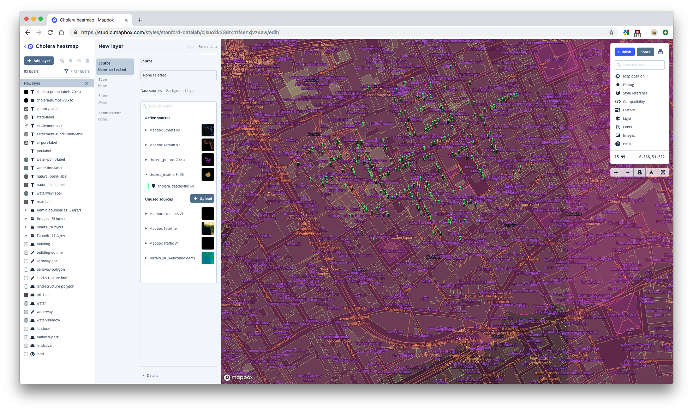
```

* Change the layer type to _Heatmap_. 

```{r, echo=FALSE}
knitr::include_graphics("images/screenshots/heatmap-type.png")
```

* Change to the __Style__ tab.
* Adjust the heatmap radius in the __Radius__ tab. Experiment with different values.
* Your map should now look like this:

```{r, echo=FALSE}
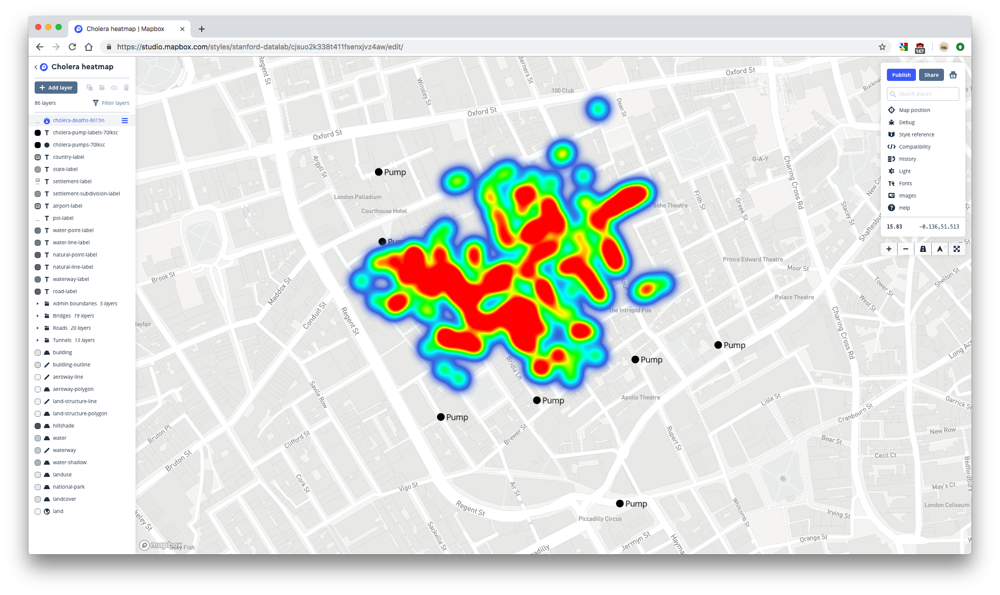
```

### Change the layer order

The heatmap is on top of the pump layers, obscuring some of the pumps. 

* Change the order of the layers by dragging and dropping the layer names in the list on the left. You want the _cholera_deaths-*_ layer on top of both the pumps layers.

```{r, echo=FALSE}
knitr::include_graphics("images/screenshots/heatmap-layers-list.png")
```

* Your map should end up looking like this:

```{r, echo=FALSE}
knitr::include_graphics("images/screenshots/heatmap-final.png")
```

Your heatmap map is complete!

### Publish your map

* Click the blue __Publish__ button on the right to publish your map. Then, choose __Publish__.
* Change your map to _Public_.
* Copy the URL and save it somewhere. You'll need the URL for the next section.

## Static maps

Right now, your maps are interactive and cannot be viewed in documents that only support static images. In this section, you'll learn how to create static versions of your two maps using the Mapbox Static API.

You can use the API to create PNG files or JPEG raster tiles. We'll create PNG files.

The trick of using the static API is getting the API call right. Here's what the basic API call looks like:

`https://api.mapbox.com/styles/v1/{username}/{style_id}/static/{longitude},{latitude},{zoom}/{width}x{height}?access_token={access_token}`

We'll walk you through how to get each piece of information. We'll store each piece of information in a variable so that we can just use `str_glue()` at the end to create the call. 

### Access token and username

Retrieve your public access token by going to your [Mapbox account page](https://account.mapbox.com/).

Store your access token and Mapbox username in variables.

```{r}
username <- "stanford-datalab"
access_token <- "pk.eyJ1Ijoic3RhbmZvcmQtZGF0YWxhYiIsImEiOiJjajh1aW84OXYxMWh5MndwMG9jYnhpc3ZiIn0.pSqbBonZJw667NNhHNX1Kg#16.2/51.513683/-0.136001"
```

### Style ID

Decide whether you want to first create a static version of your circles map or your heatmap. Then, take a look at that map's URL. 

If you don't already have the map's URL, you can always retrieve it from the [Styles page](https://studio.mapbox.com), which lists all your custom styles. 

* Click on __Share & use__ next to the name of your map. 

```{r, echo=FALSE}
# sara
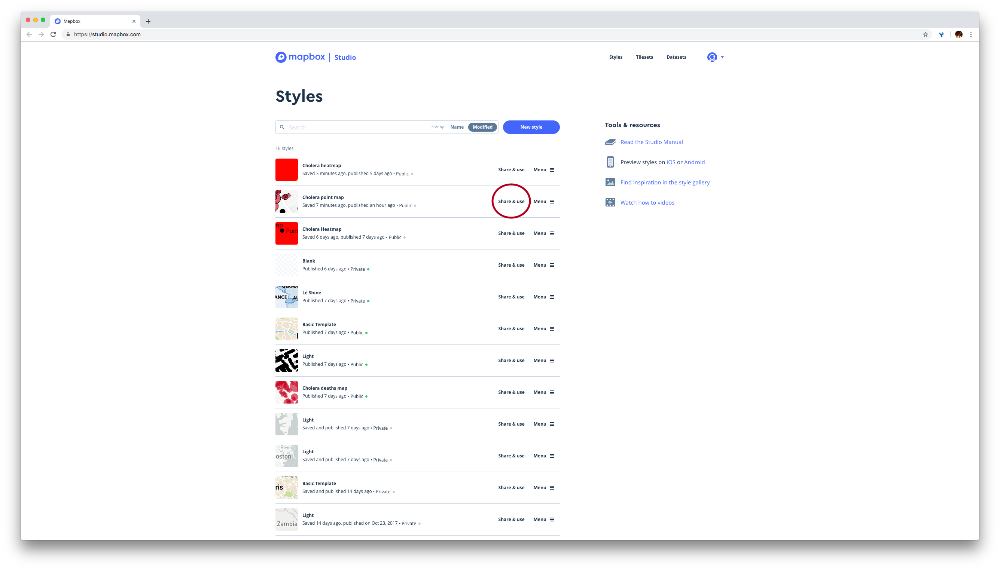
```

* Then, copy the URL.

```{r, echo=FALSE}
knitr::include_graphics("images/screenshots/styles-page-share-url.png")
```

The style ID for your map is the string that comes after your username and before the _.html_. 

[https://api.mapbox.com/styles/v1/stanford-datalab/<mark>cjsqj3qvi3zrf1fld8qvywggs</mark>.html?fresh=true&title=true&access_token=pk.eyJ1Ijoic3RhbmZvcmQtZGF0YWxhYiIsImEiOiJjajh1aW84OXYxMWh5MndwMG9jYnhpc3ZiIn0.pSqbBonZJw667NNhHNX1Kg#16.2/51.513683/-0.136001](https://api.mapbox.com/styles/v1/stanford-datalab/cjsqj3qvi3zrf1fld8qvywggs.html?fresh=true&title=true&access_token=pk.eyJ1Ijoic3RhbmZvcmQtZGF0YWxhYiIsImEiOiJjajh1aW84OXYxMWh5MndwMG9jYnhpc3ZiIn0.pSqbBonZJw667NNhHNX1Kg#16.2/51.513683/-0.136001)

Store your map's style ID in a variable.

```{r}
style_id <- "cjsqj3qvi3zrf1fld8qvywggs"
```

### Location, zoom, and size

Now, you'll need to figure out the right longitude, latitude, zoom level, and dimensions for your PNG. This can require some tweaking.

There are several tools you can use to help you out. 

First, Mapbox has a [Static API playground](https://docs.mapbox.com/help/interactive-tools/static-api-playground/). 

```{r, echo=FALSE}
# sara
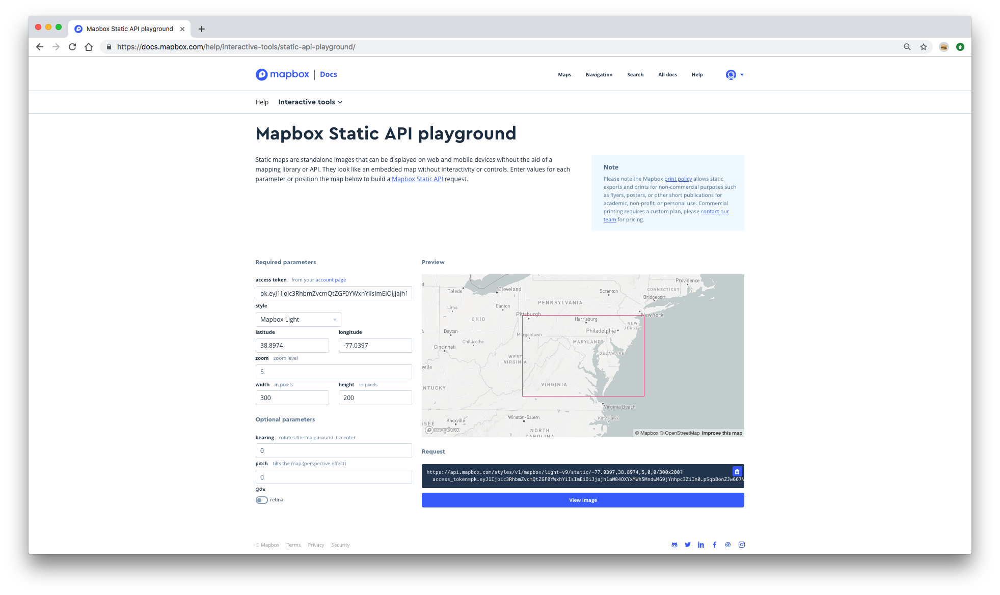
```

By changing the parameters, you can see the images that different API calls create. Unfortunately, you can't load a custom style into the playground, which means we can't see our pumps and deaths data. This makes it difficult to tell if our call will include all our data.

You can see the current longitude, latitude, and zoom level of your custom style in Studio by clicking on __Map position__.

```{r, echo=FALSE}
knitr::include_graphics("images/screenshots/static-map-position.png")
```

This feature is useful for the static API because you can get a sense of which longitude, latitude, and zoom level will display your custom data. However, it's hard to get a sense of what differently sized PNG images will look like in Studio.

The static API playground and Studio each have their own strengths and weaknesses, so here's our recommended strategy for finding your static API parameters:

* Find your map's longitude, latitude, and zoom level from the __Map position__ feature in Studio. 
* Copy and paste these values into the Static API playground. 
* In Studio, look for the features that bound your data. For example, look for the roads and buildings that fall on the outer edges of the pumps and deaths data.
* Then, back in the Static API playground, adjust the width, height, and zoom level until the PNG looks like it would roughly include those bounding features. 

You don't have to perfect these parameters at this stage. We'll show you how to further tweak them later on. Just try to roughly include all your data at a reasonable zoom level. 

Store your chosen longitude, latitude, zoom, width, and height values in variables. 

```{r}
# latitude <- [your latitude]
# longitude <- [your longitude]
# zoom <- [your zoom]
# width <- [your width]
# height <- [your height]
```

(We didn't include ours here so that you play around with different values yourself.)

```{r, echo=FALSE}
longitude <- -0.135852
latitude <- 51.51356
zoom <- 16.15
width <- 1200
height <- 800
```

### Create your API call

Now, you just have to add in all this information to the base call. `str_glue()` makes this really easy.

```{r}
api_call <- 
  str_glue(
    "https://api.mapbox.com/styles/v1/{username}/{style_id}/static/{longitude},{latitude},{zoom}/{width}x{height}?access_token={access_token}"
  )

api_call
```

If you copy and paste this link into a browser, you should see an image of your map. If you only see the basemap, and not whatever features you added, your map might be set to _Private_. If this happens, you'll need to change your map to _Public_. The easiest way to do this is to go to your [Styles homepage](https://studio.mapbox.com). Then, click on __Share & use__ next to your map and select _Public_.

### Download your PNG

Now, we need to download the image. Use `download.file()` to download your image as a PNG. 

```{r, message=FALSE}
circles_map_file <- "images/cholera_circles_map.png"
download.file(url = api_call, destfile = circles_map_file)
```

### Include your image in R Markdown

To include your image in an R Markdown document, use `knitr::include_graphics`.

```{r}
knitr::include_graphics(circles_map_file)
```

Now you can see the exact image that your API parameters produce. If you're not happy with the image, all you have to do is adjust your parameters slightly, and then rerun your code. It's difficult to adjust latitude and longitude values by hand, so we recommend adjusting the height, width, and zoom first. If you think you do need to change the latitude and longitude, you may have to go back to Studio or the static API.  

Here's a function that includes all the code to make this process a bit easier. The function creates the API call, downloads the image, and displays the image using knitr.

```{r}
create_png <- function(username, 
                       style_id, 
                       longitude, 
                       latitude, 
                       zoom, 
                       width, 
                       height, 
                       access_token, 
                       file_name) {
  api_call <- 
    str_glue(
      "https://api.mapbox.com/styles/v1/{username}/{style_id}/static/{longitude},{latitude},{zoom}/{width}x{height}?access_token={access_token}"
    )
  
  download.file(url = api_call, destfile = file_name)
  knitr::include_graphics(circles_map_file)
}
```


