# Maps with basemaps

## Introduction

In this chapter, you'll learn how to use Mapbox to create interactive and static maps with basemaps.

We'll use the following libraries and data.


```r
library(tidyverse)
library(leaflet)
library(leaflet.mapboxgl)
library(sf)

africa <- read_sf("data/countries/africa.geojson")
```

leaflet.mapboxgl is on CRAN. You can install the package from GitHub by running the following line of code in the console.


```r
remotes::install_github("rstudio/leaflet.mapboxgl")
```

### Basemaps

You already know how to create static maps with `geom_sf()`. 


```r
africa %>% 
  ggplot() + 
  geom_sf()
```


In the above plot, `geom_sf()` draws the boundaries represented in the `geometry` column. This map is informative, but sometimes you'll want to plot your geospatial data on top of other features. For example, say we wanted a map of Africa with country names, major cities, rivers, streets, and lakes. We could incorporate this information by adding data sources to our ggplot2 plot, but this could quickly get time-consuming, and our data would start to take up a lot of space.

Luckily, there are easier ways of adding _basemaps_ to your maps. A basemap is just a map that lies underneath the data you want to visualize. Basemaps can include any number of features. For example, a basemap could just be a satellite image, or could include features like rivers, streets, and geographic boundary names. 

Here's an example basemap from Mapbox, whose basemaps and tools we'll use in this chapter.


Mapbox's basemaps are interactive, and include more detail as you zoom in. For example, if we zoom in on Senegal, we'll be able to see specific cities and some bodies of water.

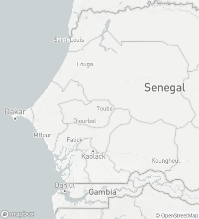

If we zoom in further on Dakar, the basemap will include roads and airports.


Basemaps add context to your geospatial data and provide common elements you can use across different data sets. In this chapter, we'll visualize the location of cholera deaths and water pumps on top of a basemap, allowing us to see the street locations of the deaths and water pumps.

In this chapter, we'll use [Mapbox](https://www.mapbox.com/) to create both interactive and static maps that include basemaps. We will begin by using Mapbox Studio to create interactive maps and then use the Mapbox Static API to turn these interactive maps into PNG images.

### Tiles

With interactive web maps, it is usually possible to both zoom and move around the map, which means you'll only ever see a portion of the map at a time. Web maps handle this functionality by using _tiles_. Each tile contains data for a specific square sub-region of a map, and there are different sets of tiles for different zoom levels. 

There are two types of tiles: raster and vector. Raster tiles store their data in pixels, like small pictures. Because they store their data in pixels, you can't easily edit aspects of the tiles. For example, imagine you had a set of raster tiles with highways colored blue, and you wanted to change the color of all highways to yellow. You would have to change each pixel that corresponded to a highway. 

Vector tiles store all data in vector format. This means that they can distinguish between different _layers_, such as roads, country borders, and lakes, and you can easily manipulate these elements before rendering. If you wanted to change the color of the highways in a vector tileset, all you'd have to do is change the way that highways layer is displayed, which is fast and easy with vector data. Vector tiles also make operations like tilting possible.

Below, we'll walk you through the creation of two interactive Mapbox maps. When you're done creating each map, you'll have created a custom vector tileset with various layers and a set of rules for styling these layers.

### Mapbox

Mapbox provides infrastructure for developers to create vector-tile maps and map applications. It has a library of vector-tile basemaps with data from [OpenStreetMap](https://www.openstreetmap.org/about), an open data effort that works like Wikipedia for maps.

Mapbox has its own JavaScript library, Mapbox GL JS, that it uses to write custom interactive web maps. Instead of explaining Mapbox GL JS, we'll use Mapbox Studio, which is a web interface to Mapbox GL JS. In Studio, you can create and edit Mapbox maps and share them via URL. You can then use Mapbox's Static API to create static versions of your maps. 

To introduce you to Mapbox Studio, we'll walk you through the creation of two maps that visualize John Snow's data on the 1854 London cholera epidemic. The first map will use circles to represent the number of deaths at a given location. The second will be a heatmap.

There are many features of Mapbox Studio that we won't cover here. You can read more about Studio in the [Studio Manual](https://docs.mapbox.com/studio-manual/overview/). 

## Data

### Background

In late August 1854, a severe cholera epidemic broke out in the Soho neighborhood of London. As recounted by Dr. John Snow

> The most terrible outbreak of cholera which ever occurred in this kingdom, is
  probably that which took place in Broad Street, Golden Square, and adjoining
  streets, a few weeks ago. Within two hundred and fifty yards of the spot
  where Cambridge Street joins Broad Street, there were upwards of five hundred
  fatal attacks of cholera in ten days. The mortality in this limited area
  probably equals any that was ever caused in this country, even by the plague;
  and it was much more sudden, as the greater number of cases terminated in a
  few hours. The mortality would undoubtedly have been much greater had it not
  been for the flight of the population. 

[@snow-1855, p. 38]

In 1854, many mistakenly believed that cholera was spread through the air. However, because the deaths were concentrated in such a small area, Snow suspected that the outbreak was due to contaminated water from a community water pump at Broad and Cambridge streets.

> On proceeding to the spot, I found that nearly all of the deaths had taken
  place within a short distance of the pump. There were only ten deaths in
  houses situated decidedly nearer to another street pump. In five of these
  cases the families of the deceased persons informed me that they always sent
  to the pump in Broad Street, as they preferred the water to that of the pump
  which was nearer. In three other cases, the deceased were children who went to
  school near the pump in Broad Street. Two of them were known to drink the
  water; and the parents of the third think it probable that it did so. 
  
[@snow-1855, p. 39-40]

Snow reported his findings to the authorities responsible for the community water supply, who then removed the handle from the Broad Street pump. The epidemic soon ended.

Snow visualized his data by creating a map showing the location of local water pumps and deaths from the outbreak. This map helped overturn the prevailing belief that cholera was an airborne disease. As a result, London improved its water infrastructure and developed procedures to eliminate future cholera outbreaks.

###  Download data

Robin Wilson compiled Snow's data and made it available on his [website](http://blog.rtwilson.com/john-snows-cholera-data-in-more-formats/). We've formatted his data and converted the two files to GeoJSON to make them easy to upload to Mapbox. These two GeoJSON files are available in the `data` folder. Let's read them in to see what they look like.

The original data can be downloaded [here](http://rtwilson.com/downloads/SnowGIS_KML.zip).


```r
deaths <- read_sf("data/cholera/cholera_deaths.geojson")
pumps <- read_sf("data/cholera/cholera_pumps.geojson")
```


```r
deaths
#> Simple feature collection with 250 features and 1 field
#> Geometry type: POINT
#> Dimension:     XY
#> Bounding box:  xmin: -0.14 ymin: 51.5 xmax: -0.133 ymax: 51.5
#> Geodetic CRS:  WGS 84
#> # A tibble: 250 × 2
#>   deaths      geometry
#>    <int>   <POINT [°]>
#> 1     15 (-0.137 51.5)
#> 2      8 (-0.139 51.5)
#> 3      8 (-0.135 51.5)
#> 4      8 (-0.134 51.5)
#> 5      7 (-0.135 51.5)
#> 6      5 (-0.136 51.5)
#> # … with 244 more rows
```


```r
pumps
#> Simple feature collection with 8 features and 0 fields
#> Geometry type: POINT
#> Dimension:     XY
#> Bounding box:  xmin: -0.14 ymin: 51.5 xmax: -0.132 ymax: 51.5
#> Geodetic CRS:  WGS 84
#> # A tibble: 8 × 1
#>        geometry
#>     <POINT [°]>
#> 1 (-0.137 51.5)
#> 2  (-0.14 51.5)
#> 3  (-0.14 51.5)
#> 4 (-0.132 51.5)
#> 5 (-0.134 51.5)
#> 6 (-0.136 51.5)
#> # … with 2 more rows
```

Download `cholera_deaths.geojson` and `cholera_pumps.geojson`. Next, we'll upload these files to Mapbox.

### Upload data

If you don't already have a Mapbox account, create one by going to https://account.mapbox.com/auth/signup/.

Earlier, we introduced you to the idea of tiles. We want to create a custom tileset that includes standard features like roads and location labels, but that also includes the locations of the water pumps and deaths due to the cholera outbreak. In order to create this custom tileset, we first need to upload our data and convert it into its own tileset.

* Go to [Mapbox Studio](https://studio.mapbox.com/). If you're elsewhere in Mapbox, you can click the astronaut icon in the upper-right and then click __Studio__.
* Click on __Tilesets__ in the upper-right corner.
* Click the blue button labeled __New tileset__.
* Upload `cholera_deaths.geojson` and `cholera_pumps.geojson`. You'll have to upload one at a time. 
* The two tilesets should now appear in the list. Each tileset will have a random string identifier after its name. Below we will use a "*" to represent this identifier. If your tilesets did not appear, try refreshing your browser.


## Circle map

You now have everything you need to create a map in Mapbox Studio. We'll create the circle map first. At the end, you should have something that looks like this: 


You can view our completed map [here](https://api.mapbox.com/styles/v1/stanford-datalab/cjsqj3qvi3zrf1fld8qvywggs.html?fresh=true&title=true&access_token=pk.eyJ1Ijoic3RhbmZvcmQtZGF0YWxhYiIsImEiOiJjajh1aW84OXYxMWh5MndwMG9jYnhpc3ZiIn0.pSqbBonZJw667NNhHNX1Kg#16.1/51.513564/-0.135852/0).

### Create a style

In Mapbox, a _style_ is a specification for how your map will be drawn. Behind the scenes, this specification is written in JavaScript, but you can edit it from Studio. You can think of a Mapbox style like ggplot2 code for a visualization: it includes information about which data to use, specifies how to map that data to visual elements, and controls features of the visualization not related to the data (e.g., background colors, basemap elements).

We'll build our custom style by building on one of Mapbox's existing styles.

* Click on the __Styles__ tab in the upper-right corner to take you back to the Styles page.
* Click __New style__. Take a look at the different template styles that Mapbox offers. Some are better for displaying data than others. We want the cholera deaths and water pumps to be the focus of our map, so we'll use a basemap with a subtle, light background. The Light style is the best option.
* Select the Light style.
* You should now be in Mapbox Studio and should see a basemap centered on Boston.
* Name your map something informative. In the upper-left corner, you'll see the default name of your map. If you used the Light style, your map will be named _Light_. Click on this name and change it to something like _Cholera circles_.

Your screen should now look like this:

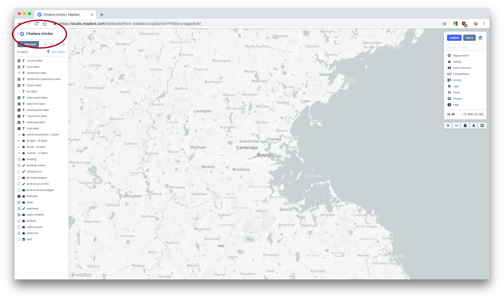

### Zoom in on London

The map is currently centered on Boston because the Light style's default location is Boston. Move the map to London either by manually navigating or by searching for _London_ in the search bar in the top-right corner.

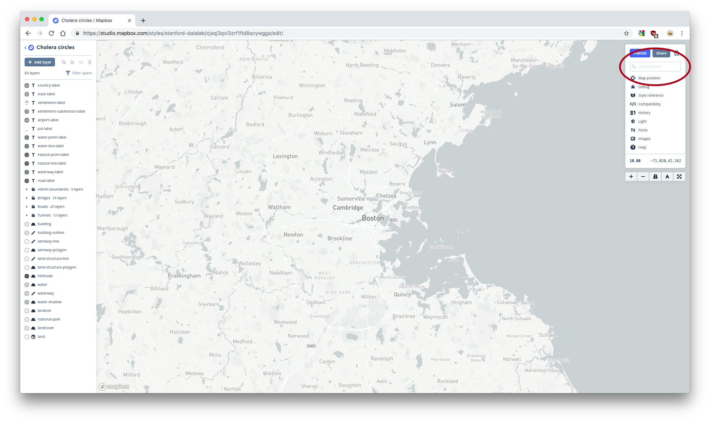

### Add the deaths layer

The individual unit of a Mapbox map is a layer. You can see a list of all the layers included in the Light basemap on the left side of Studio. 

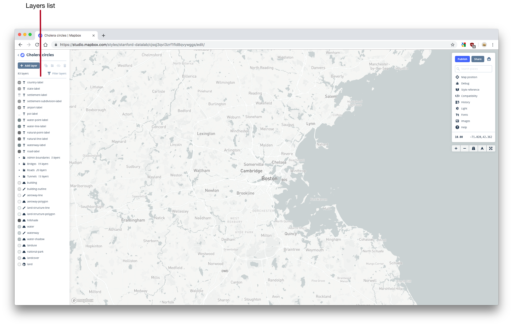

You can think of layers like ggplot2 geoms. Just like a geom, each layer maps data to a visual element (e.g., dots, lines, text), and you can control exactly how the data is mapped to that visual element. 

You can edit an existing layer by clicking on its name. A layer editor will open. To hide the layer editor, click on the name of the layer again.

We'll need three different layers to represent the deaths and pumps data. One layer will encode the deaths data as circles whose areas represent the number of deaths in that location. Another layer will represent the pump locations as circles. A final layer will label the pumps. First, we'll add the deaths layer.

* Click the gray __Add layer__ button in the upper-left corner. Your map will immediately look different. Don't worry, this isn't because you've accidentally changed some feature. Mapbox is just highlighting all the layers without styling them. 
* You are now in the layer editor for a new layer. Notice that _New layer_ now appears in the layer list on the left, and is highlighted to indicate that you're currently editing this layer.
* Notice that under _Data sources_ in the layer editor, there are _Active sources_ and _Unused sources_. Each of these sources is a tileset. Active sources are tilesets that the map currently uses to create different layers. Unused sources are available tilesets that the map does not currently use. 
* If you click on the name of a tileset, you'll see all the available layers in that tileset. The tilesets included with Mapbox, like Mapbox Streets v8, each contain many different layers. Our custom tilesets (_cholera_deaths-* _ and _cholera_pumps-* _) each contain only one.

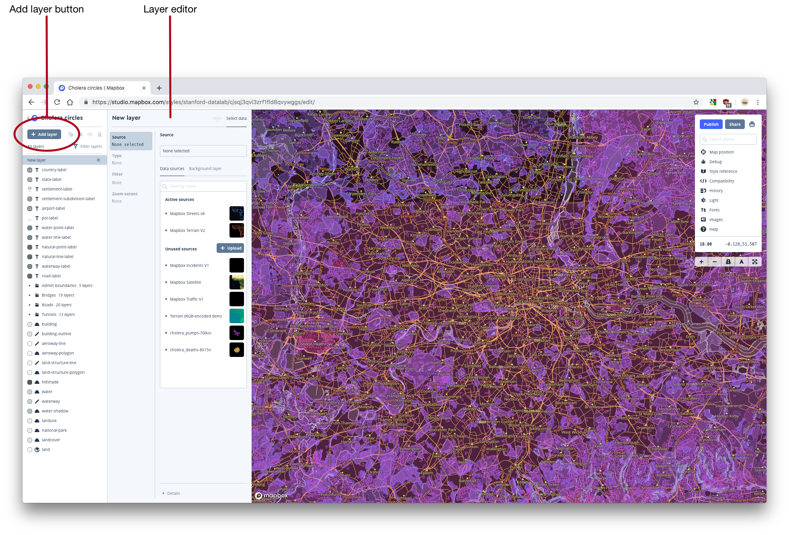

* Click on your _cholera_deaths-* _ tileset from the _Unused sources_ list. Then, click on the layer titled _cholera_deaths-* _ that appears underneath. 


* We've now created a layer. By default, this layer will be named _cholera_deaths-* _.


* Notice that you're currently in the __Select data__ tab of the layer editor. The layer editor has two tabs: __Select data__ and __Style__. In the __Select data__ tab, you can choose your data and choose the layer type. You can think of the layer type as a geom. By default, the type for our current layer is _Circle_, which happens to be what we want. For some of the layers we'll make later on, we'll need to change the type.

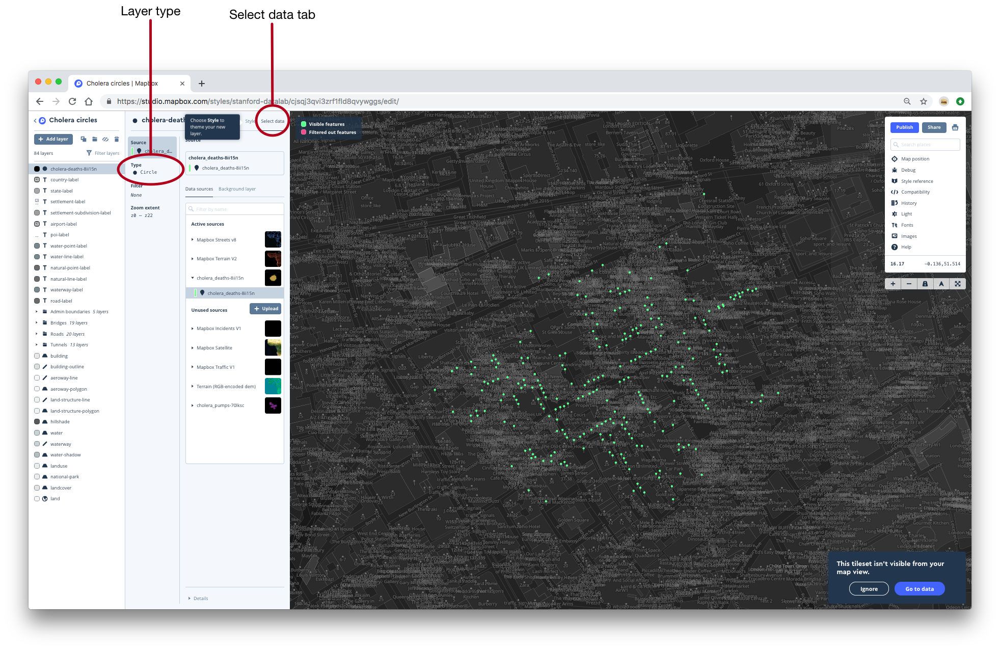

* If you click on the __Style__ tab, the map's appearance will go back to normal. In the __Style__ tab, you can control the appearance of your layer. If you think of the __Select data__ tab as where you choose the geom, the __Style__ tab is where you specify the aesthetics. In the next section, you'll use the __Style__ tab to map number of deaths to circle area.
* You should now see black dots on your map that represents the locations of deaths.

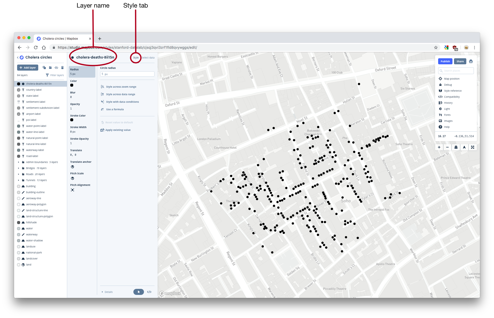

### Scale the dots

Right now, all the dots are the same size. We want to scale them so that the area of the circle encodes the number of deaths. 

* We said that the __Style__ tab controls the aesthetic mappings. For circles, one aesthetic mapping you can control are the radii of the circles. 
* To map the number of deaths to circle radii, we could select __Style across data range__ from the __Radius__ tab. However, this will linearly scale the radii of the circles by the number of deaths at that location. We actually want to scale the areas of the circles, not the radii, so we'll have to use a custom formula.
* Click __Use a formula__.


* The formula we want to use takes the form `x * sqrt(deaths)`, where `x` is a constant. 
* Start adding the formula to the formula box. Use `sqrt()` for square root. Click on __Insert a data field__ and then on __deaths__ to use the `deaths` variable.
* Here's what your map should look like without `x`:

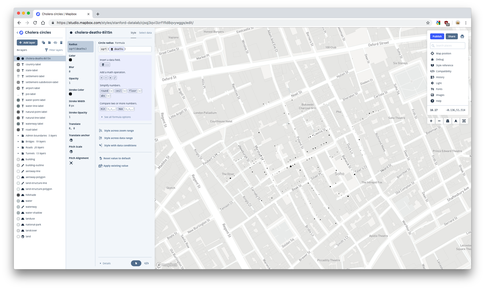

* Play around with different values of the constant `x` until you're happy with the appearance of your dots. Your map should now look something like this:


In this screenshot, the editing sidebar for the deaths layer is hidden. You can hide the editing sidebar by clicking on the name of the layer you're editing.

### History

If you need to, you can undo actions by clicking on __History__ in the menu on the right. Clicking the undo arrow will undo your last action. You can also click on the name of an action to revert your map further.


### Style the dots

* Make sure you're on the __Style__ tab of the _cholera_deaths-* _ layer editor.
* Use the __Color__ tab to change the color of your circles to red. 


* At some zoom levels, the dots are over-plotted. Change the opacity of the dots in the __Opacity__ tab. Then, add a border to the circles by adjusting the stroke width in the __Stroke width__ tab.
* When you're done, your map should look something like this:


### Add the pumps layer

Now, we'll add a layer to represent the pump locations.

* Again, click on __Add layer__ to create a new layer.
* Click on your _cholera_pumps-* _ tileset from the unused sources list. Then, click on the _cholera_pumps-* _ layer that appears underneath.
* Go to the __Style__ tab of the layer editor.

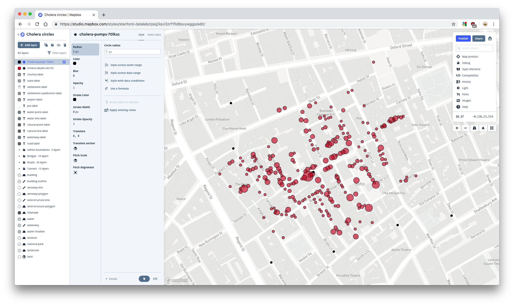

* If you want to change the size of the circles, go to __Radius__ and change the value of __Circle radius__.
* You should now have a map that looks like this:

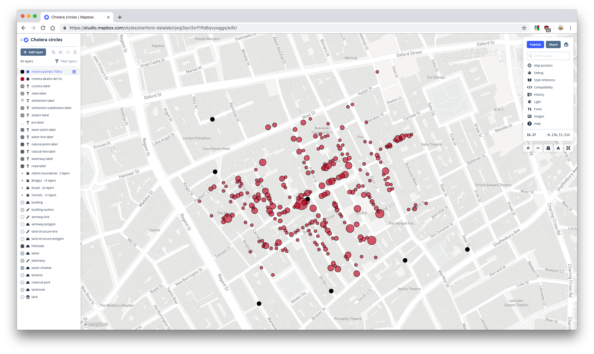

### Add the pumps labels layer

It would be helpful to label the dots that represents pumps. In ggplot2, you could use `geom_point()` and `geom_text()` to create a plot with labeled points. Similarly, in Mapbox you have to add two layers to create labeled points: one for the points and one for the labels. We already added the point layer, so now we just have to add the label layer.

* Add a new layer by clicking __Add layer__. Your _cholera_pumps-* _ tileset is now an active source. Click on your _cholera_pumps-* _ tileset then on the _cholera_pumps-* _ layer that appears underneath.
* By default, the layer will be named _cholera_pumps-* (1)_. Change the name of the layer to _cholera-pump-labels-* _ by clicking on the layer name towards the top of the layer editor.


* By default, the layer type for the _cholera-pump-labels-* _ layer is _Circle_, but we want text, not circles, for this layer. Change the layer type in the __Type__ tab to _Symbol_.

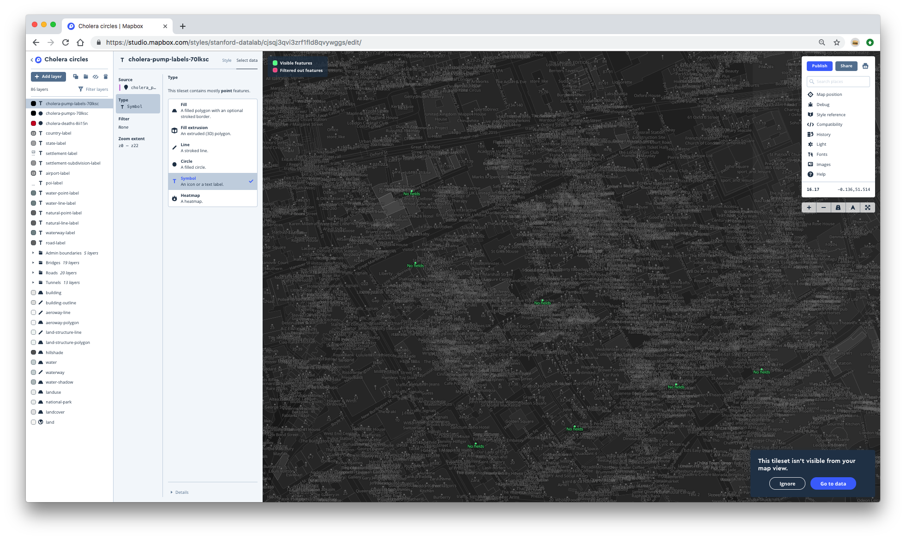

* Now, we need to set the labeling text. Move back to the __Style__ tab, then type _Pump_ in the text box. This will set every label to _Pump_.
* The labels are directly on top of the dots. To offset the labels, first click on __Position__. This tab contains several variables related to the positioning of the text.


* Use the __Text offset__ tab to adjust the offsets. You should end up with something that looks like this:


Your map is complete! 

### Publish your map

Now, you just need to make your map visible to others by publishing. 

* When you publish your map, you'll get a URL that points to your published map. Your published map will have a starting location and zoom level. Navigate to __Default map position__. If the __Lock__ option is set to unlocked (the dot is towards the left and the oval is white), it means that your published map will default to the location and zoom level of your map when you click __Publish__. You want the __Lock__ option to be unlocked. Then, move and zoom your map until you're happy. 

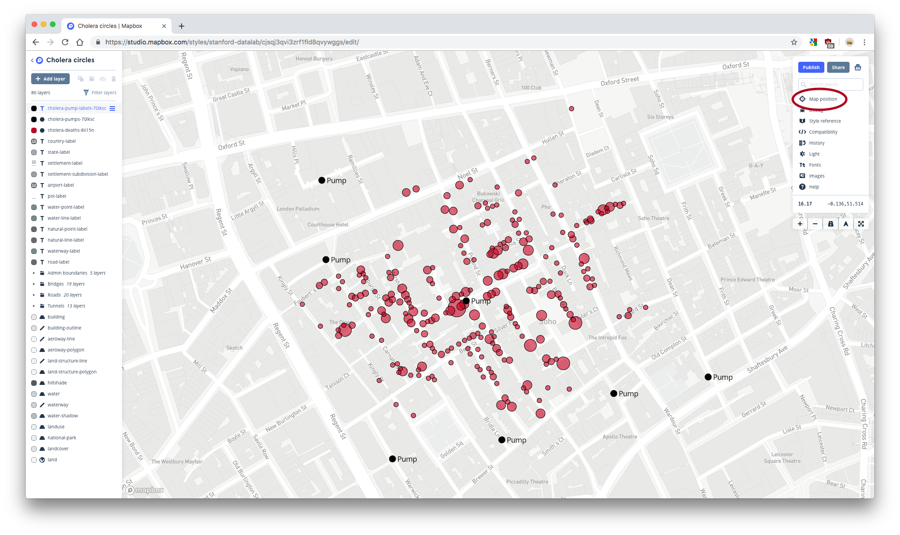

* Publish your map by clicking the blue __Publish__ button in the upper-right corner. 

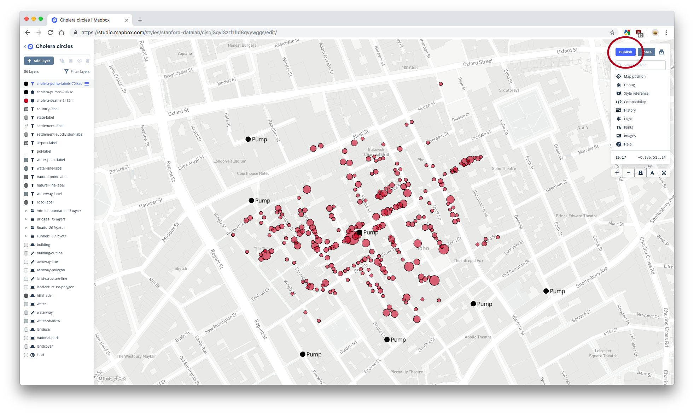

* Click the __Share...__ button next to __Publish__ and copy the Share URL. This URL points to the shareable version of your map. Paste the URL into a new browser tab. Your map should open at the default location and zoom level that you set earlier. The Share URLs take the following form:

`https://api.mapbox.com/styles/v1/{username}/{style_id}.html?fresh=true&title=true&access_token={access_token}#{zoom}/{latitude}/{longitude}`

If your map does not default to the location that you set earlier, you may have to manually change your Share URL. To do so, replace your Share URLs zoom, latitude, and longitude with your desired values. Remember that you can find these values under _Map position_ in Studio.

* Once you have the correct Share URL, copy and store it somewhere. You'll need this URL for the static API later on.

## Heatmap

Now, we'll create a heatmap. Your final result should look something like this:

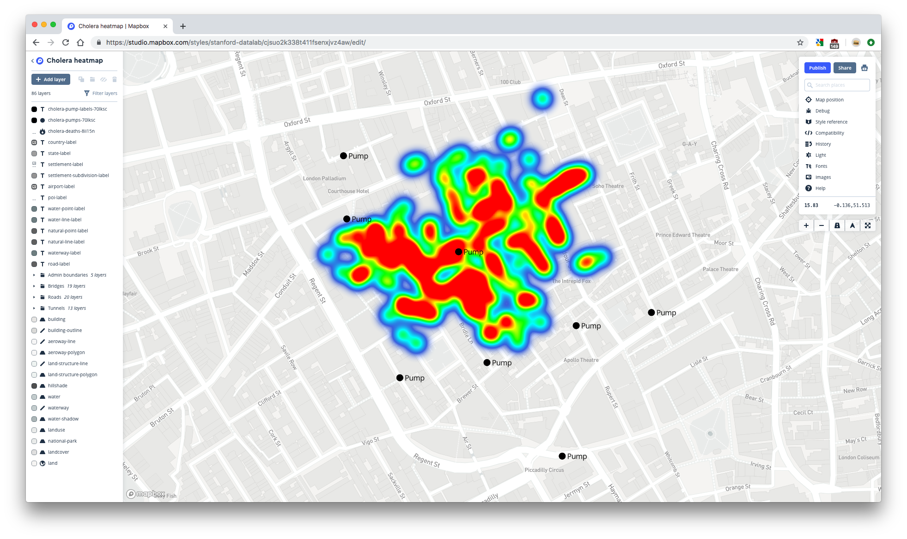

You can view the map [here](https://api.mapbox.com/styles/v1/stanford-datalab/cjsuo2k338t411fsenxjvz4aw.html?fresh=true&title=true&access_token=pk.eyJ1Ijoic3RhbmZvcmQtZGF0YWxhYiIsImEiOiJjajh1aW84OXYxMWh5MndwMG9jYnhpc3ZiIn0.pSqbBonZJw667NNhHNX1Kg#16.1/51.513564/-0.135852/0).

### Create a style

* Go back to the [Studio homepage](https://studio.mapbox.com/).
* Create a new map with a Light style basemap by clicking on __New style__ and choosing the Light style. 
* Once the map has opened, change the name to something more informative, like _Cholera heatmap_.
* Navigate to London.

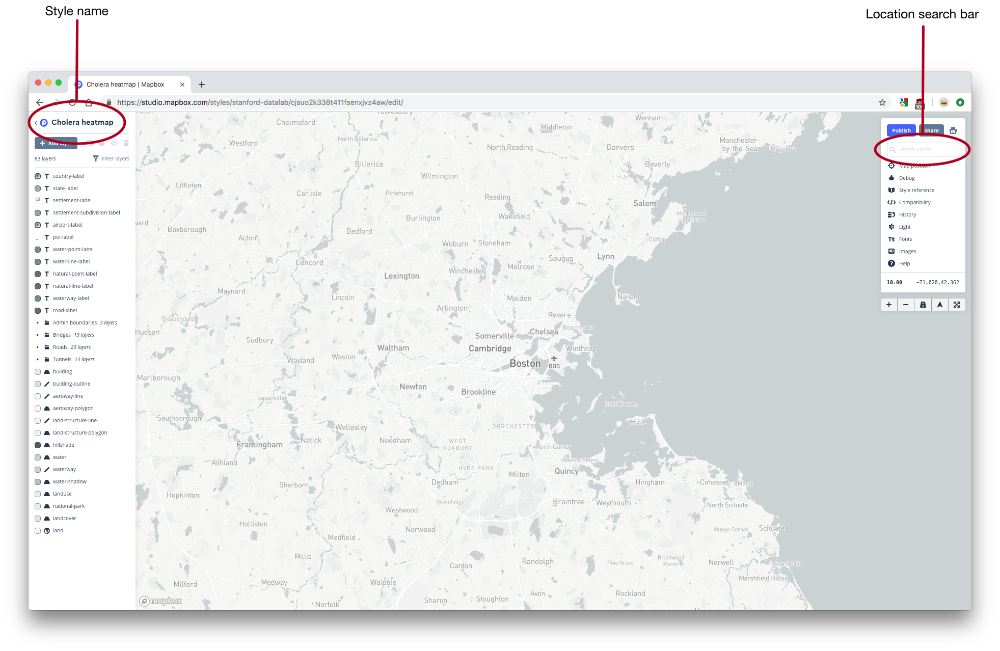

### Add the pumps layers

Mapbox can plot layers on top of each other. Each time you add a new layer, Mapbox places it on top of all other existing layers. This means that you'll typically want to add layers from the bottom up. Our heatmap has a heatmap layer underneath the two pumps layers, so ordinarily you would add the heatmap layer first, and then add the pumps layers. We'll add the pumps layers first just so we can demonstrate how to manually change the layer order.

We'll add the two pumps layers exactly as we did for the circles map.

* First, add a layer for the pump dots. Click __Add layer__, then select the _cholera_pumps-* _ layer from underneath your _cholera_pumps-* _ tileset.


* If you want, change the radius of the pumps circles. You'll end up with a map that looks like this:

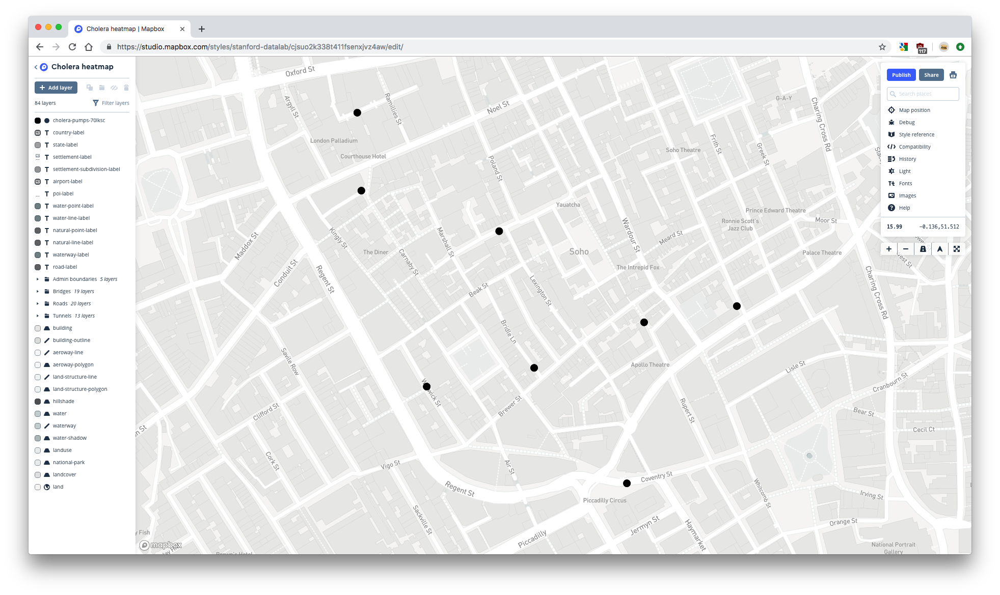

* Next, add the pump labels layer. Select the _cholera_pumps-* _ layer from your _cholera_pumps-* _ tileset that will now appear in the active sources list.


* Change the name of the layer to _cholera-pump-labels-* _ and change the type to _Symbol_. 

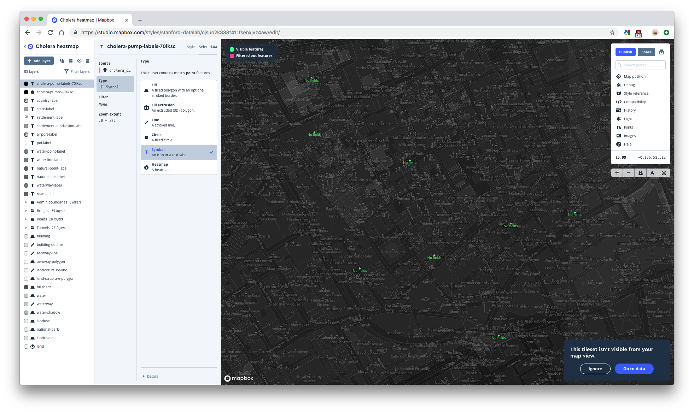

* Change to the __Style__ tab to set the text and adjust the offsets. Recall that the text offset setting is under the __Position__ tab.


### Add the deaths heatmap layer

* Add the deaths layer by selecting the _cholera_deaths-* _ layer from underneath your _cholera_deaths-* _ tileset.

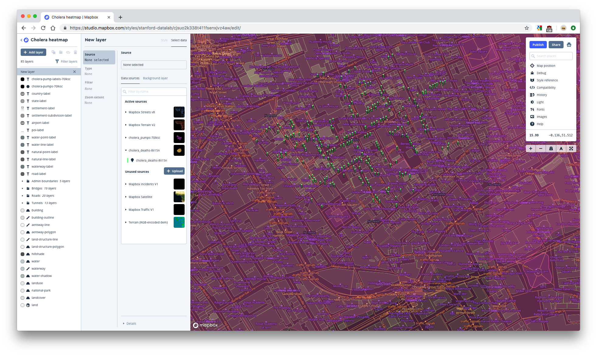

* Change the layer type to _Heatmap_. 


* Change to the __Style__ tab.
* Right now, the `deaths` variable is not mapped to the intensity of the heatmap. If you zoom in on your heatmap, you'll notice that each heatmap dot has the same intensity, regardless of the number of deaths at  that location. To map `deaths` to intensity, we'll use the __Weight__ parameter. We'll adjust the heatmap weights similarly to how we adjusted the radii of the circles for the previous map. 
* Click on __Weight__, then __Style across data range__. Select _deaths_ and click __Done__. This maps `deaths` to the heatmap weight, but the default is a uniform relationship, so the weight doesn't actually change across different values of `deaths`. 


* Change the way the weights are scaled by adjusting the minimum and/or maximum weight.

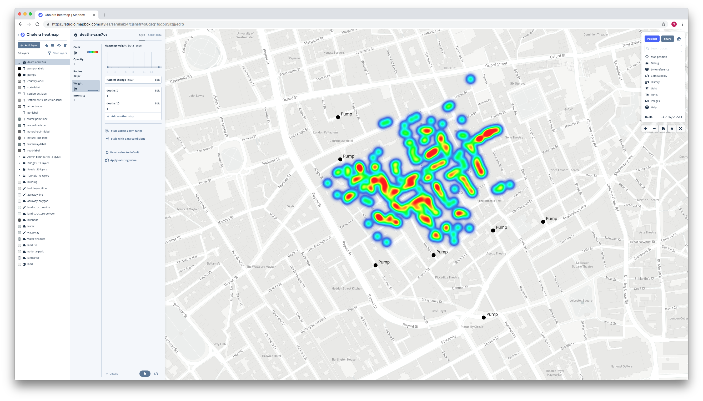

* Your heatmap should now look something like this:


* Now, adjust the heatmap radius (the radii of the individual circles) in the __Radius__ tab. Experiment with different values.
* Your map should now look like this:


### Change the layer order

The heatmap currently rests on top of the pump layers, obscuring some of the pumps. 

* Change the order of the layers by dragging and dropping the layer names in the list on the left. You want the _cholera_deaths-* _ to be below both of the pumps layers.

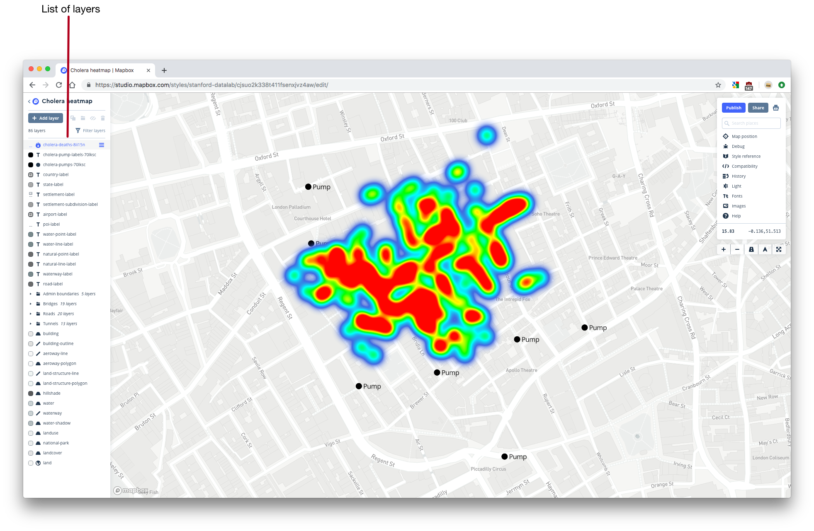

* Your map should end up looking like this:


Your heatmap map is complete!

### Publish your map

* To finalize your map, again center your map on your data, then make sure the __Lock__ option is unlocked. 
* Click the blue __Publish__ button in the top-right to publish your map.
* Click on __Share...__ and then copy the Share URL. Again, paste this URL into a new browser tab to check that your map defaults to the correct location. If your map does not default to the location you set earlier, you may have to manually change the Share URL by following the steps we explained in 1.3.9.
* Copy the Share URL and store it somewhere. You'll need it for the next section.

## Static maps

You can share your interactive Mapbox map via its Share URL, but you'll sometimes want a static version to embed in documents that only support static images. In this section, you'll learn how to create static versions of your two maps using the Mapbox Static API.

### Mapbox Static API

The Static API is an interface to Mapbox's servers. You can use this interface to request data from its servers to download to your computer. In order to download your specific map, you need to create an API call. This call tells the API exactly what data you want to download. You'll need to tell the API which map to download and which location and zoom level to use in order to create a static version of an interactive map. 

You create the API call by specifying parameters in a URL. Here's what the basic Mapbox Static API call looks like:

`https://api.mapbox.com/styles/v1/{username}/{style_id}/static/{longitude},{latitude},{zoom}/{width}x{height}?access_token={access_token}`

This call will create a PNG version of a map.

We'll guide you through the process of gathering each piece information. We'll store each piece of information in a variable so that we can just use `str_glue()` at the end to create the call.

### Username and access token

First, store your Mapbox username and access token in variables.


```r
username <- "stanford-datalab"
access_token <- Sys.getenv("MAPBOX_ACCESS_TOKEN")
```

### Style ID

Decide whether you want to first create a static version of your circles map or your heatmap. Then, find that's map's style ID. You can find the style ID in the Share URL you copied earlier. 

If you don't already have your map's Share URL, you can retrieve it from the [Styles page](https://studio.mapbox.com). To do so: 

* Click on __Share & use__ next to the name of your map. Then, copy the Share URL.

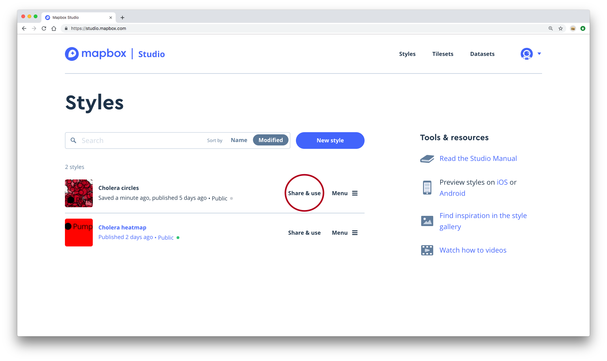

The style ID for your map is the string that comes after your username and before the _.html_. 

[https://api.mapbox.com/styles/v1/stanford-datalab/<mark>cjsqj3qvi3zrf1fld8qvywggs</mark>.html?fresh=true&title=true&access_token=pk.eyJ1Ijoic3RhbmZvcmQtZGF0YWxhYiIsImEiOiJjajh1aW84OXYxMWh5MndwMG9jYnhpc3ZiIn0.pSqbBonZJw667NNhHNX1Kg#16.1/51.513564/-0.135852/0](https://api.mapbox.com/styles/v1/stanford-datalab/cjsqj3qvi3zrf1fld8qvywggs.html?fresh=true&title=true&access_token=pk.eyJ1Ijoic3RhbmZvcmQtZGF0YWxhYiIsImEiOiJjajh1aW84OXYxMWh5MndwMG9jYnhpc3ZiIn0.pSqbBonZJw667NNhHNX1Kg#16.1/51.513564/-0.135852/0)

Store your map's style ID in a variable.


```r
style_id <- "cjsqj3qvi3zrf1fld8qvywggs"
```

### Longitude and latitude

Next, we need to figure which longitude and latitude to use. With the static API, the longitude and latitude indicate the center of the map. 

We'll use the sf package and the `pumps` and `deaths` data to figure out the exact center of our data. 

Notice that the southernmost pump is far away from the rest of the data. 


```r
ggplot() +
  geom_sf(data = deaths, color = "red") +
  geom_sf(data = pumps)
```


We'll exclude this pump and focus on where most of the data lies.

First, we need to find the latitude of each pump. Then, we can use `slice_max()` to filter out the southernmost pump.


```r
pumps %>% 
  rowwise() %>% 
  mutate(latitude = st_coordinates(geometry)[[2]]) %>% 
  ungroup() %>% 
  slice_max(latitude, n = nrow(.) - 1) -> z3
```

Now, we'll find the bounding box of all our data. Once we have the bounding box, we can find the center of the box. 


```r
bounding_box <-
  pumps %>% 
  rowwise() %>% 
  mutate(latitude = st_coordinates(geometry)[[2]]) %>% 
  ungroup() %>% 
  slice_max(latitude, n = nrow(.) - 1) %>% 
  st_geometry() %>% 
  c(deaths %>% st_geometry()) %>% 
  st_bbox() %>% 
  st_as_sfc() 
```

`st_bbox()` calculates the bounding box. 

`st_centroid()` finds the centroid of the box.


```r
centroid <-
  bounding_box %>% 
  st_centroid()
```

We can visualize all of these geospatial operations using `geom_sf()`.


```r
ggplot() +
  geom_sf(data = bounding_box) +
  geom_sf(data = deaths) +
  geom_sf(data = pumps) +
  geom_sf(data = centroid, color = "red", shape = 3, size = 3)
```

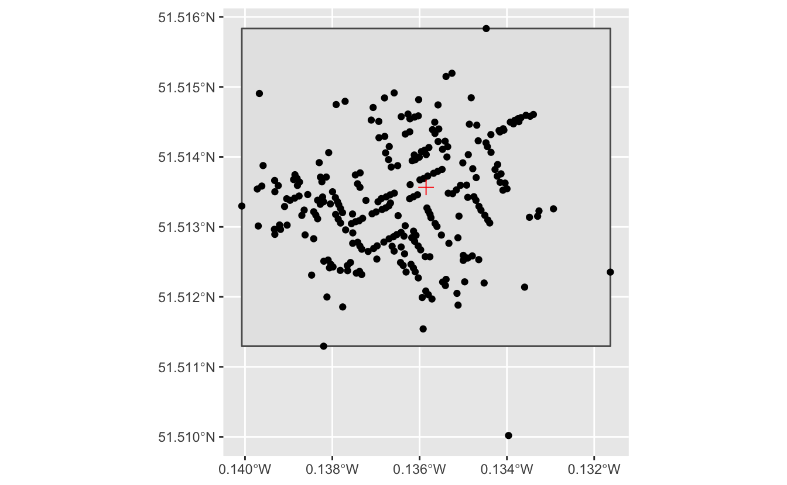

Finally, we'll store the longitude and latitude of the centroid in variables so that we can use them later on in the static API call.


```r
longitude <- st_coordinates(centroid)[[1]]
latitude  <- st_coordinates(centroid)[[2]]
```


```r
longitude
#> [1] -0.136
latitude
#> [1] 51.5
```

### Zoom and PNG size

Next, we need to figure out which zoom level and PNG width and height to use. 

You can see the current longitude, latitude, and zoom level of your custom style in Studio by clicking on __Map position__.


Move your map to the center point you found in the previous section. Then, determine which zoom level best shows the data. Remember that we're excluding the southernmost pump. Copy this zoom level.

Now, you need to figure out how to set the height and width of your PNG so that all your data is shown at your chosen zoom level. Unfortunately, you can't see what different PNGs will look like in Studio.

The [Static API playground](https://docs.mapbox.com/help/interactive-tools/static-api-playground/) shows the results of different static API calls. 


Set the longitude and latitude to the values you found in the previous section. Set the zoom level to the value you just copied. Now, play around with different widths and heights until the PNG seems like it would include all the data (excluding the southernmost pump) and is a reasonable size.

The Static API playground doesn't let you load custom styles, so you won't be able to see the pumps and deaths data. This means you might have to move back-and-forth between the playground and Studio. In Studio, look for the features (roads, buildings, etc.) that bound the data. Then, in the playground, make sure you PNG includes those features. 

You don't have to perfect your zoom level, height, and width at this stage. We'll show you how to further tweak them later on. Just try to roughly include all your data at a reasonable zoom level. 

Store your chosen longitude, latitude, zoom, width, and height values in variables. 


```r
zoom <- [your zoom]
width <- [your width]
height <- [your height]
```


### Create your API call

Now, you just have to add in all this information to the base call. `str_glue()` makes this easy.


```r
api_call <- 
  str_glue(
    "https://api.mapbox.com/styles/v1/{username}/{style_id}/static/",
    "{longitude},{latitude},{zoom}/{width}x{height}?access_token={access_token}"
  )

api_call
#> https://api.mapbox.com/styles/v1/stanford-datalab/cjsqj3qvi3zrf1fld8qvywggs/static/-0.135851999982979,51.5135645380918,16.1/1200x800?access_token=pk.eyJ1Ijoic3RhbmZvcmQtZGF0YWxhYiIsImEiOiJjajh1aW84OXYxMWh5MndwMG9jYnhpc3ZiIn0.pSqbBonZJw667NNhHNX1Kg
```

If you copy and paste this link into a browser, you should see an image of your map. If you only see the basemap, and not whatever features you added, your map might be set to _Private_. If this happens, you'll need to change your map to _Public_. The easiest way to do this is to go to your [Styles homepage](https://studio.mapbox.com). Then, click on the three dots next to your map and select _Make public_.

### Download your PNG

Now, we need to download the image. Use `download.file()` to download your image as a PNG. 


```r
file_circles_map <- "images/cholera_circles_map.png"
download.file(url = api_call, destfile = file_circles_map)
```

The result should be a downloaded PNG, which you can view from RStudio or a browser. If you were able to see your PNG by pasting `api_call` into a browser, but your PNG did not download, you may need to set a different download method using the `method` argument of `download.file()`. You can see all available methods in the documentation for `download.file()`.

### Display your image

To include your image in an R Markdown document, use `knitr::include_graphics`.


```r
knitr::include_graphics(file_circles_map)
```


Now you can see the exact image that your API parameters produce. If you're not happy with the image, all you have to do is adjust your parameters slightly, and then rerun your code. It's difficult to adjust longitude and latitude values by hand, so we recommend adjusting the width, height, and zoom first. If you think you do need to change the longitude and latitude, you may have to go back to Studio or the static API.

Here's a function that includes all the code to make this process a bit easier. The function creates the API call, downloads the image, and displays the image using knitr. All you need to do is pass in the parameters.


```r
mapbox_png <- function(
  username,
  style_id,
  longitude,
  latitude,
  zoom,
  width,
  height,
  access_token,
  path
) {
  str_glue(
    "https://api.mapbox.com/styles/v1/{username}/{style_id}/static/",
    "{longitude},{latitude},{zoom}/{width}x{height}?access_token={access_token}"
  ) %>% 
    download.file(url = ., destfile = path)
  
  knitr::include_graphics(path = path)
}
```

## leaflet.mapboxgl

The package [leaflet.mapboxgl](https://github.com/rstudio/leaflet.mapboxgl) extends the leaflet package to allow you to add Mapbox vector tiles to leaflet maps. leaflet.mapboxgl has many advantages. First, we'll use `leaflet.mapboxgl::addMapboxGL()` to display our Mapbox maps in R. Note that leaflet.mapboxgl requires RStudio version 1.2 or later to display your plots. 

* You'll need a Mapbox access token and style URL. You can retrieve your public access token by going to your [Mapbox account page](https://account.mapbox.com/).

* Your style URL is different than the share URL you found earlier. To find your style URL, first go to the [Styles page](https://studio.mapbox.com/). Then, click on the three dots next to your style and copy the style URL. 


* Store your style URL and access token in variables.


```r
style_url <- "mapbox://styles/stanford-datalab/cjsqj3qvi3zrf1fld8qvywggs"
access_token <- Sys.getenv("MAPBOX_ACCESS_TOKEN")
```

Now, we can display our map. `addMapboxGL()` adds Mapbox vector tiles to a leaflet map. You can adjust the height and width of a leaflet plot with the `height` and `width` arguments.


```r
leaflet(width = 950, height = 800)  %>%
  addMapboxGL(
    accessToken = access_token,
    style = style_url
  )
```

```{=html}
<div id="htmlwidget-d3667212eccb4277b61b" style="width:950px;height:800px;" class="leaflet html-widget"></div>
<script type="application/json" data-for="htmlwidget-d3667212eccb4277b61b">{"x":{"options":{"crs":{"crsClass":"L.CRS.EPSG3857","code":null,"proj4def":null,"projectedBounds":null,"options":{}}},"calls":[{"method":"addMapboxGL","args":[true,null,null,{"style":"mapbox://styles/stanford-datalab/cjsqj3qvi3zrf1fld8qvywggs","accessToken":"pk.eyJ1Ijoic3RhbmZvcmQtZGF0YWxhYiIsImEiOiJjajh1aW84OXYxMWh5MndwMG9jYnhpc3ZiIn0.pSqbBonZJw667NNhHNX1Kg"}]}]},"evals":[],"jsHooks":[]}</script>
```

Another advantage of leaflet.mapboxgl is that you can add any leaflet function to your map. We'll use this functionality to add tooltips, which you can't do in Mapbox Studio. 

The function `addCircleMarkers()` adds circles to a leaflet plot. You can use the `label` argument to set the text of a tooltip. 

Note that you have to set `data = deaths` inside `addCircleMarkers()` in order to reference the data.


```r
leaflet(width = 950, height = 800) %>% 
  addMapboxGL(
    accessToken = access_token,
    style = style_url
  ) %>%
  addCircleMarkers(
    radius = ~ 5 * sqrt(deaths),
    opacity = 0,
    fillOpacity = 0,
    label =
      case_when(
        deaths$deaths == 1 ~ "1 death",
        deaths$deaths > 1  ~ str_c(deaths$deaths, " deaths"),
        TRUE ~ NA_character_
      ),
    data = deaths
  )
```

```{=html}
<div id="htmlwidget-cd6c846cf12ddac036e2" style="width:950px;height:800px;" class="leaflet html-widget"></div>
<script type="application/json" data-for="htmlwidget-cd6c846cf12ddac036e2">{"x":{"options":{"crs":{"crsClass":"L.CRS.EPSG3857","code":null,"proj4def":null,"projectedBounds":null,"options":{}}},"calls":[{"method":"addMapboxGL","args":[true,null,null,{"style":"mapbox://styles/stanford-datalab/cjsqj3qvi3zrf1fld8qvywggs","accessToken":"pk.eyJ1Ijoic3RhbmZvcmQtZGF0YWxhYiIsImEiOiJjajh1aW84OXYxMWh5MndwMG9jYnhpc3ZiIn0.pSqbBonZJw667NNhHNX1Kg"}]},{"method":"addCircleMarkers","args":[[51.513249,51.512964,51.512532,51.513056,51.512765,51.51316,51.513154,51.513891,51.514522,51.51396,51.513821,51.513999,51.513692,51.514061,51.513204,51.513116,51.513111,51.512428,51.512491,51.513214,51.5133,51.511991,51.51197,51.511882,51.51225,51.512846,51.514561,51.513996,51.513672,51.513603,51.513458,51.513502,51.513418,51.513323,51.513216,51.513055,51.513745,51.513122,51.513271,51.512727,51.512844,51.513422,51.513227,51.513459,51.513431,51.513402,51.512593,51.514843,51.514108,51.514507,51.514274,51.514148,51.513795,51.513766,51.513404,51.513742,51.514748,51.514526,51.513361,51.513184,51.513359,51.513328,51.513427,51.513381,51.513441,51.513402,51.51338,51.513411,51.513583,51.513541,51.512893,51.513025,51.512649,51.51278,51.512914,51.513046,51.513087,51.513016,51.51289,51.512358,51.512083,51.512573,51.512672,51.513165,51.513293,51.513431,51.513475,51.513481,51.513594,51.513132,51.512555,51.513152,51.513637,51.513524,51.514146,51.514201,51.514382,51.514402,51.514581,51.514743,51.514335,51.514145,51.514359,51.514575,51.514134,51.514033,51.513945,51.513359,51.513855,51.513616,51.513712,51.513644,51.514794,51.514706,51.513317,51.513262,51.513462,51.513169,51.51324,51.513164,51.513178,51.513592,51.513641,51.513693,51.513676,51.51359,51.513663,51.513502,51.513298,51.513291,51.513013,51.512965,51.513027,51.512831,51.512885,51.512526,51.512465,51.512415,51.51251,51.512378,51.512447,51.512374,51.512339,51.512364,51.512319,51.51254,51.512692,51.512957,51.512765,51.512726,51.512681,51.513074,51.513187,51.512921,51.512859,51.51283,51.512782,51.512729,51.512868,51.512723,51.512654,51.512713,51.512615,51.512491,51.512449,51.512465,51.512413,51.512271,51.512355,51.512031,51.51205,51.512162,51.512212,51.512575,51.512794,51.512879,51.512939,51.512198,51.512215,51.513098,51.513238,51.513379,51.513528,51.51318,51.513048,51.513006,51.512883,51.51327,51.512585,51.512521,51.513137,51.513228,51.513258,51.513544,51.513626,51.51382,51.513724,51.513704,51.513831,51.513915,51.513597,51.514032,51.513758,51.514065,51.51423,51.514319,51.514377,51.514357,51.514497,51.514472,51.514504,51.514546,51.514594,51.514606,51.515834,51.515195,51.515149,51.514818,51.514914,51.514496,51.514467,51.514453,51.514845,51.514389,51.514399,51.514224,51.51422,51.514326,51.514544,51.514569,51.514586,51.514612,51.514293,51.514058,51.513961,51.514027,51.514076,51.514096,51.513726,51.513482,51.513429,51.513378,51.513875,51.513565,51.513918,51.513772,51.513711,51.512311,51.511998,51.511856],[-0.136859,-0.139187,-0.134645,-0.134394,-0.135329,-0.136493,-0.135098,-0.134212,-0.133821,-0.136099,-0.135485,-0.135374,-0.135905,-0.138083,-0.137767,-0.138337,-0.137865,-0.137984,-0.137584,-0.136996,-0.136705,-0.13594,-0.135717,-0.135119,-0.135394,-0.13618,-0.133676,-0.136008,-0.135992,-0.136217,-0.136675,-0.137995,-0.13793,-0.138276,-0.138426,-0.137811,-0.138856,-0.137306,-0.136778,-0.136033,-0.135122,-0.134897,-0.135801,-0.136049,-0.13614,-0.136228,-0.134999,-0.136804,-0.135475,-0.136935,-0.136931,-0.136696,-0.135582,-0.135679,-0.136877,-0.137472,-0.137912,-0.137108,-0.137883,-0.137537,-0.1382,-0.138045,-0.138223,-0.138337,-0.138762,-0.139045,-0.13897,-0.138863,-0.139616,-0.139719,-0.139317,-0.139036,-0.13718,-0.137419,-0.137531,-0.137562,-0.137386,-0.13633,-0.136523,-0.136102,-0.135858,-0.135765,-0.135976,-0.134505,-0.13464,-0.134756,-0.135244,-0.135344,-0.135063,-0.13574,-0.134896,-0.133296,-0.134156,-0.134091,-0.134447,-0.134479,-0.134069,-0.134085,-0.133467,-0.135578,-0.135649,-0.135357,-0.136226,-0.136421,-0.135788,-0.135849,-0.13617,-0.136953,-0.136651,-0.137422,-0.138139,-0.138239,-0.137707,-0.137065,-0.137853,-0.137812,-0.138563,-0.138378,-0.138645,-0.138698,-0.137924,-0.138799,-0.138752,-0.138808,-0.138887,-0.139239,-0.139321,-0.139316,-0.140074,-0.139094,-0.139697,-0.139327,-0.139209,-0.138427,-0.138624,-0.138096,-0.138035,-0.138065,-0.138194,-0.137818,-0.137656,-0.13765,-0.13745,-0.137376,-0.137327,-0.13698,-0.137052,-0.137695,-0.137533,-0.137368,-0.137325,-0.137466,-0.137089,-0.136424,-0.136599,-0.136699,-0.136819,-0.136973,-0.136358,-0.13663,-0.136584,-0.136423,-0.136345,-0.136437,-0.136377,-0.136197,-0.136142,-0.13603,-0.13631,-0.1358,-0.135144,-0.135409,-0.135472,-0.135871,-0.136115,-0.136083,-0.136139,-0.134522,-0.134967,-0.134437,-0.134594,-0.134709,-0.135158,-0.135762,-0.135645,-0.135602,-0.135501,-0.135832,-0.134793,-0.135,-0.133483,-0.133265,-0.132933,-0.133998,-0.134042,-0.134272,-0.13422,-0.134704,-0.134782,-0.13501,-0.134923,-0.134885,-0.134135,-0.134364,-0.134658,-0.134367,-0.134179,-0.13416,-0.133922,-0.13385,-0.133725,-0.133745,-0.133563,-0.133393,-0.134474,-0.135259,-0.135395,-0.136022,-0.136583,-0.135653,-0.13486,-0.13469,-0.134818,-0.135704,-0.135561,-0.135415,-0.135576,-0.136328,-0.136222,-0.136117,-0.13603,-0.136266,-0.136799,-0.13678,-0.136712,-0.136123,-0.135958,-0.135883,-0.135814,-0.136579,-0.136764,-0.13723,-0.136503,-0.137367,-0.1383,-0.137363,-0.138272,-0.138474,-0.138123,-0.137762],[19.3649167310371,14.142135623731,14.142135623731,14.142135623731,13.228756555323,11.1803398874989,11.1803398874989,11.1803398874989,11.1803398874989,11.1803398874989,11.1803398874989,11.1803398874989,11.1803398874989,11.1803398874989,10,10,10,10,10,10,10,10,10,10,10,10,10,10,10,10,10,10,8.66025403784439,8.66025403784439,8.66025403784439,8.66025403784439,8.66025403784439,8.66025403784439,8.66025403784439,8.66025403784439,8.66025403784439,8.66025403784439,8.66025403784439,8.66025403784439,8.66025403784439,8.66025403784439,8.66025403784439,8.66025403784439,8.66025403784439,8.66025403784439,8.66025403784439,8.66025403784439,8.66025403784439,8.66025403784439,8.66025403784439,8.66025403784439,8.66025403784439,8.66025403784439,7.07106781186548,7.07106781186548,7.07106781186548,7.07106781186548,7.07106781186548,7.07106781186548,7.07106781186548,7.07106781186548,7.07106781186548,7.07106781186548,7.07106781186548,7.07106781186548,7.07106781186548,7.07106781186548,7.07106781186548,7.07106781186548,7.07106781186548,7.07106781186548,7.07106781186548,7.07106781186548,7.07106781186548,7.07106781186548,7.07106781186548,7.07106781186548,7.07106781186548,7.07106781186548,7.07106781186548,7.07106781186548,7.07106781186548,7.07106781186548,7.07106781186548,7.07106781186548,7.07106781186548,7.07106781186548,7.07106781186548,7.07106781186548,7.07106781186548,7.07106781186548,7.07106781186548,7.07106781186548,7.07106781186548,7.07106781186548,7.07106781186548,7.07106781186548,7.07106781186548,7.07106781186548,7.07106781186548,7.07106781186548,7.07106781186548,7.07106781186548,7.07106781186548,7.07106781186548,7.07106781186548,7.07106781186548,7.07106781186548,7.07106781186548,5,5,5,5,5,5,5,5,5,5,5,5,5,5,5,5,5,5,5,5,5,5,5,5,5,5,5,5,5,5,5,5,5,5,5,5,5,5,5,5,5,5,5,5,5,5,5,5,5,5,5,5,5,5,5,5,5,5,5,5,5,5,5,5,5,5,5,5,5,5,5,5,5,5,5,5,5,5,5,5,5,5,5,5,5,5,5,5,5,5,5,5,5,5,5,5,5,5,5,5,5,5,5,5,5,5,5,5,5,5,5,5,5,5,5,5,5,5,5,5,5,5,5,5,5,5,5,5,5,5,5,5,5,5,5,5],null,null,{"interactive":true,"className":"","stroke":true,"color":"#03F","weight":5,"opacity":0,"fill":true,"fillColor":"#03F","fillOpacity":0},null,null,null,null,["15 deaths","8 deaths","8 deaths","8 deaths","7 deaths","5 deaths","5 deaths","5 deaths","5 deaths","5 deaths","5 deaths","5 deaths","5 deaths","5 deaths","4 deaths","4 deaths","4 deaths","4 deaths","4 deaths","4 deaths","4 deaths","4 deaths","4 deaths","4 deaths","4 deaths","4 deaths","4 deaths","4 deaths","4 deaths","4 deaths","4 deaths","4 deaths","3 deaths","3 deaths","3 deaths","3 deaths","3 deaths","3 deaths","3 deaths","3 deaths","3 deaths","3 deaths","3 deaths","3 deaths","3 deaths","3 deaths","3 deaths","3 deaths","3 deaths","3 deaths","3 deaths","3 deaths","3 deaths","3 deaths","3 deaths","3 deaths","3 deaths","3 deaths","2 deaths","2 deaths","2 deaths","2 deaths","2 deaths","2 deaths","2 deaths","2 deaths","2 deaths","2 deaths","2 deaths","2 deaths","2 deaths","2 deaths","2 deaths","2 deaths","2 deaths","2 deaths","2 deaths","2 deaths","2 deaths","2 deaths","2 deaths","2 deaths","2 deaths","2 deaths","2 deaths","2 deaths","2 deaths","2 deaths","2 deaths","2 deaths","2 deaths","2 deaths","2 deaths","2 deaths","2 deaths","2 deaths","2 deaths","2 deaths","2 deaths","2 deaths","2 deaths","2 deaths","2 deaths","2 deaths","2 deaths","2 deaths","2 deaths","2 deaths","2 deaths","2 deaths","2 deaths","2 deaths","2 deaths","2 deaths","1 death","1 death","1 death","1 death","1 death","1 death","1 death","1 death","1 death","1 death","1 death","1 death","1 death","1 death","1 death","1 death","1 death","1 death","1 death","1 death","1 death","1 death","1 death","1 death","1 death","1 death","1 death","1 death","1 death","1 death","1 death","1 death","1 death","1 death","1 death","1 death","1 death","1 death","1 death","1 death","1 death","1 death","1 death","1 death","1 death","1 death","1 death","1 death","1 death","1 death","1 death","1 death","1 death","1 death","1 death","1 death","1 death","1 death","1 death","1 death","1 death","1 death","1 death","1 death","1 death","1 death","1 death","1 death","1 death","1 death","1 death","1 death","1 death","1 death","1 death","1 death","1 death","1 death","1 death","1 death","1 death","1 death","1 death","1 death","1 death","1 death","1 death","1 death","1 death","1 death","1 death","1 death","1 death","1 death","1 death","1 death","1 death","1 death","1 death","1 death","1 death","1 death","1 death","1 death","1 death","1 death","1 death","1 death","1 death","1 death","1 death","1 death","1 death","1 death","1 death","1 death","1 death","1 death","1 death","1 death","1 death","1 death","1 death","1 death","1 death","1 death","1 death","1 death","1 death","1 death","1 death","1 death","1 death","1 death","1 death","1 death"],{"interactive":false,"permanent":false,"direction":"auto","opacity":1,"offset":[0,0],"textsize":"10px","textOnly":false,"className":"","sticky":true},null]}],"limits":{"lat":[51.511856,51.515834],"lng":[-0.140074,-0.132933]}},"evals":[],"jsHooks":[]}</script>
```

We already have circles encoding the number of deaths, so we've set the `opacity` and `fillOpacity` of the circle markers to 0. This makes them invisible so you can still see the layers we added in Mapbox Studio. 

